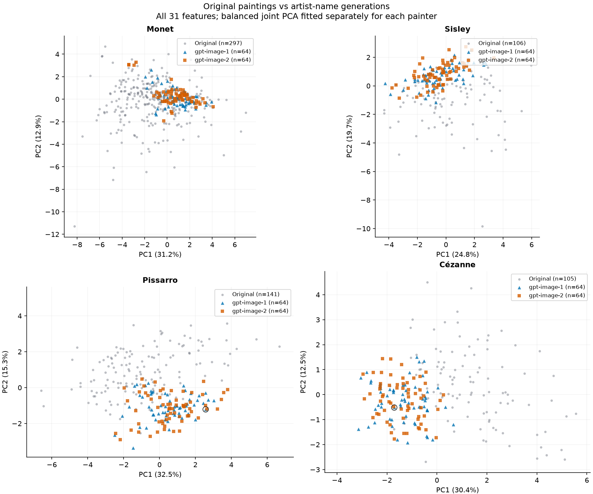
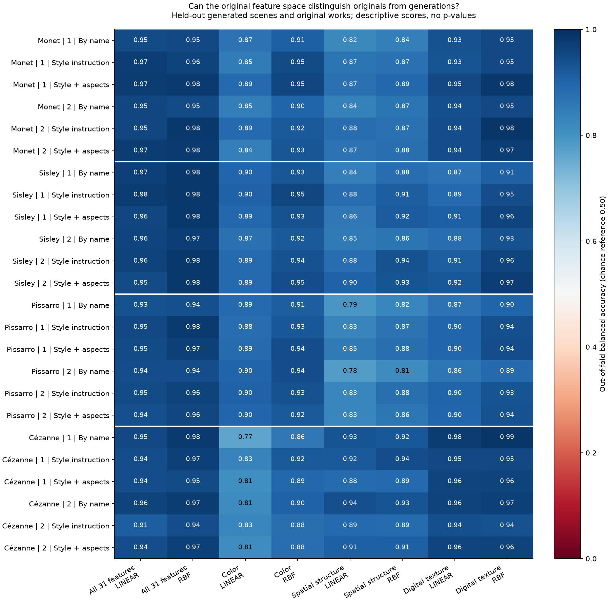
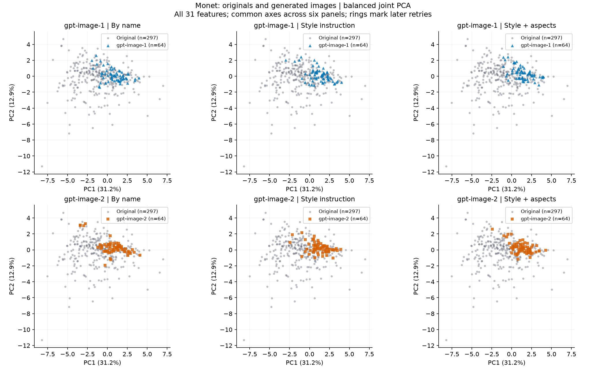
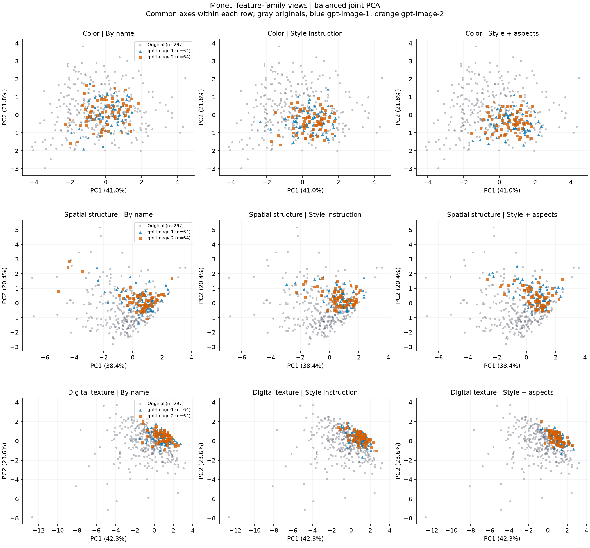
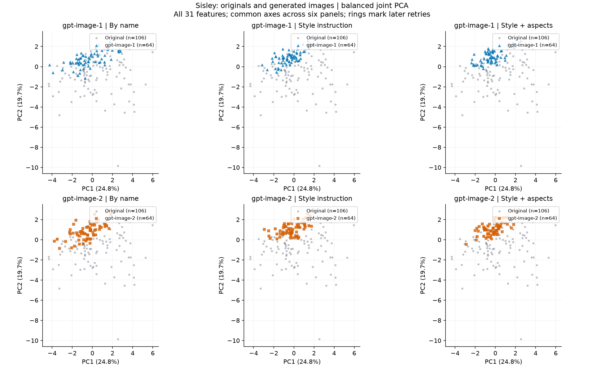
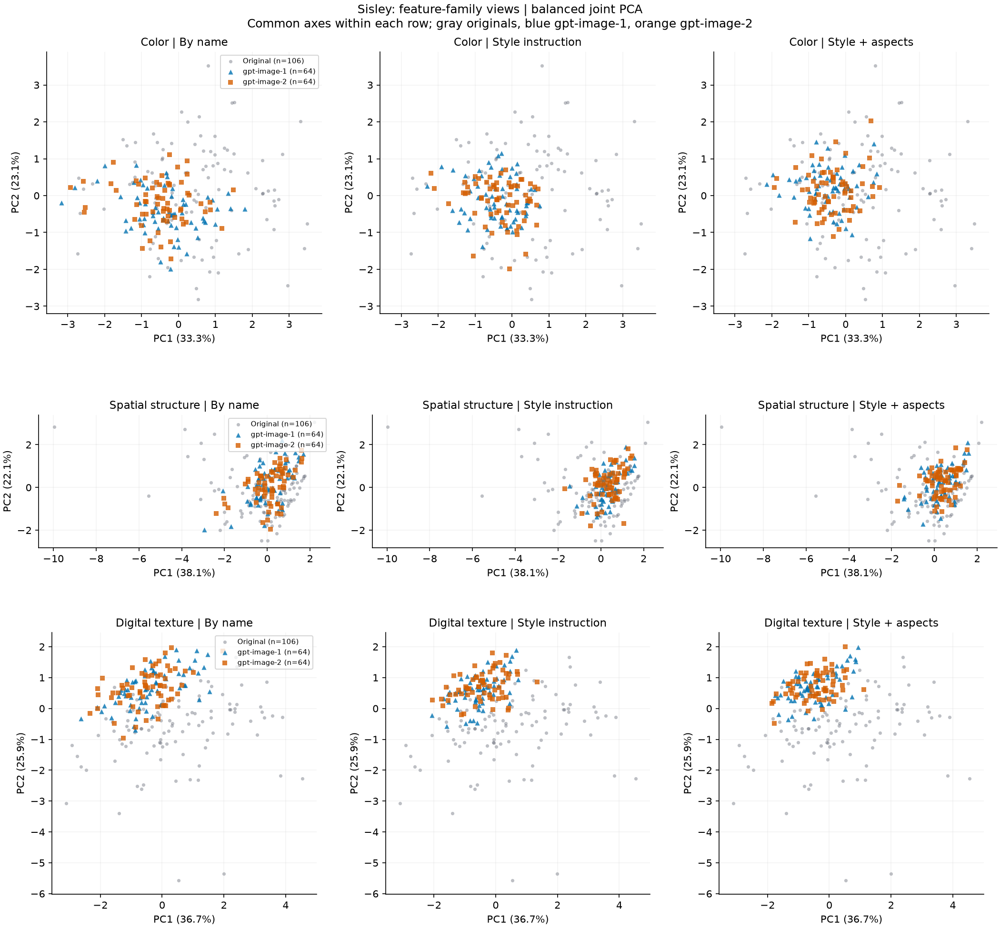
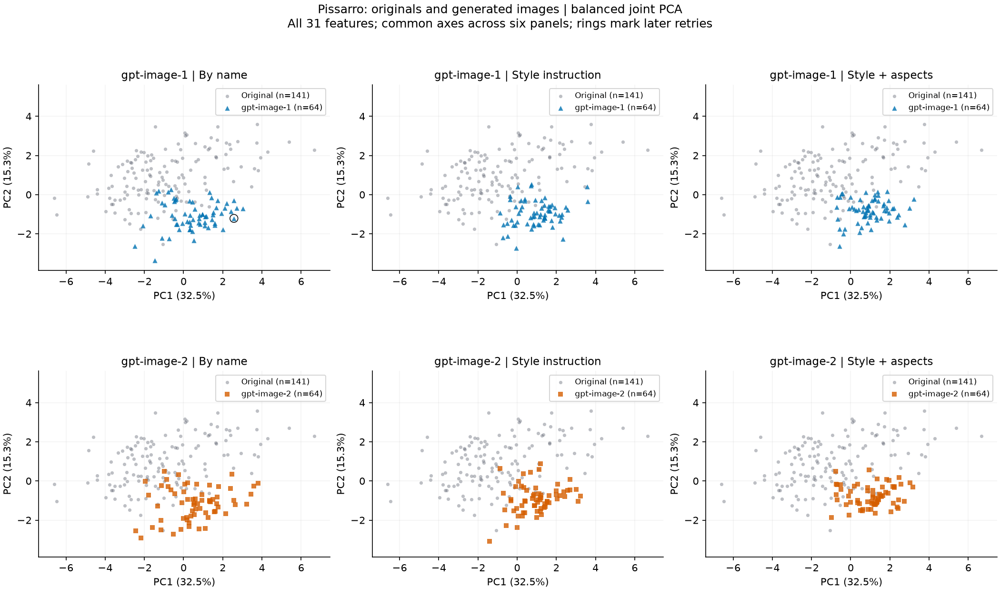
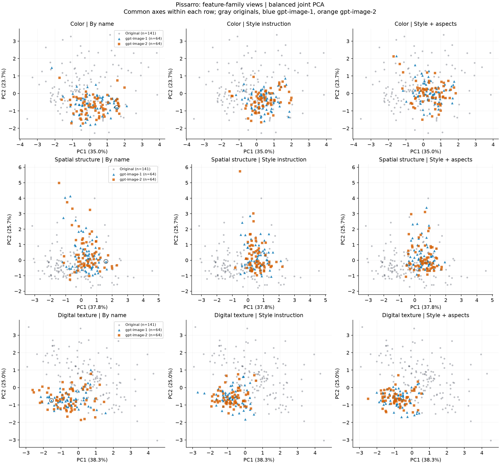
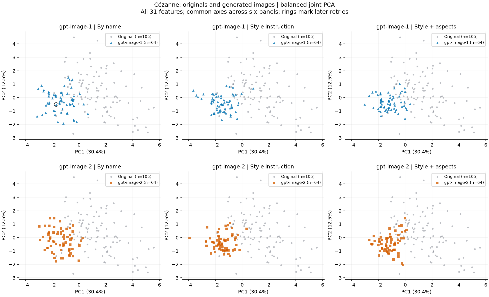
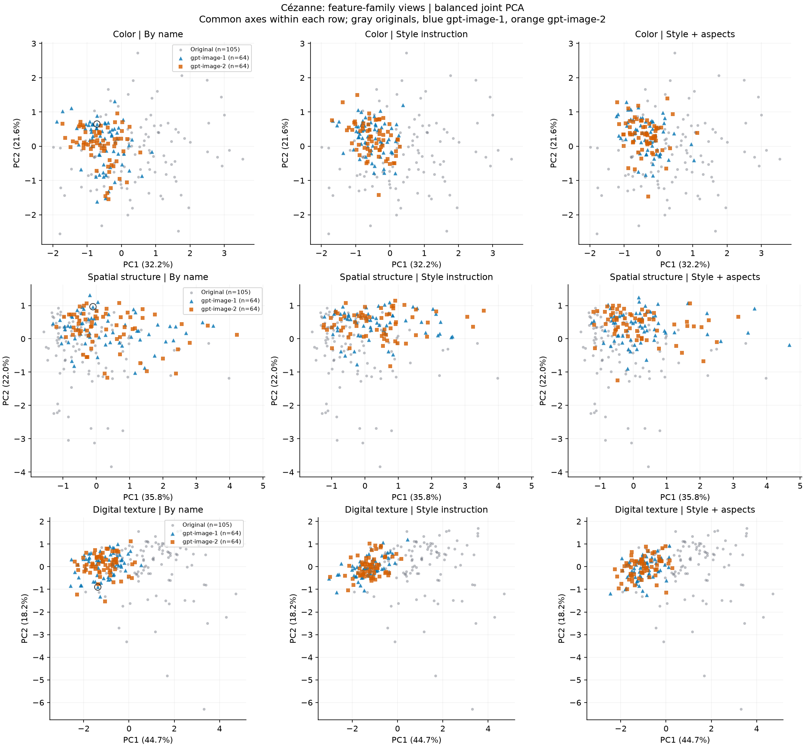

# Original versus generated painter-feature distributions

Post-hoc exploration of existing measurements, 2026-09-06. No new images or features.

## Main observations

The scatter plots show overlapping point clouds with differences in location and concentration. In the by-name overview, Monet generations form a compact band within a broader original cloud; Sisley is shifted upward, Pissarro downward/rightward, and Cézanne leftward in their respective plotted axes. These directions belong to these PCA bases, not to intrinsic artistic dimensions. The plots do not show perfectly disjoint groups.

The first two PCs retain 42.9%–47.8% of balanced all-31 variance. Most variation is therefore outside the displayed plane; full-space discrimination is needed to complement the view.

Across the 24 all-31 cells, generated/original total within-group variance ratios range from 0.206 to 0.376 (median 0.252). This separately centered sum of sample variances quantifies spread in the original standardized feature space, rather than inferring spread from unequal point counts or two-dimensional plot ranges. It remains outlier-sensitive and does not establish reduced artistic diversity.

The all-31, held-out-scene balanced accuracy across all 24 alias/painter/method cells is LINEAR: 0.913–0.976, median 0.950; RBF: 0.940–0.983, median 0.969. These are descriptive scores, not significance tests.

| Painter | Service alias | Scene: linear | Scene: RBF | Block: RBF |
| --- | --- | --- | --- | --- |
| Monet | gpt-image-1 | 0.946 | 0.953 | 0.970 |
| Monet | gpt-image-2 | 0.954 | 0.947 | 0.975 |
| Sisley | gpt-image-1 | 0.969 | 0.983 | 0.986 |
| Sisley | gpt-image-2 | 0.961 | 0.970 | 0.983 |
| Pissarro | gpt-image-1 | 0.934 | 0.940 | 0.960 |
| Pissarro | gpt-image-2 | 0.945 | 0.944 | 0.967 |
| Cézanne | gpt-image-1 | 0.951 | 0.978 | 0.978 |
| Cézanne | gpt-image-2 | 0.964 | 0.973 | 0.973 |

The table uses **by-name** prompts only. Both classifiers and all methods/families are retained in `separability.csv` and the overview heatmap. A balanced accuracy of 0.5 is the chance reference; 1 means every held-out image was classified correctly. Below-chance values are reported without reversing scores. AUC and class-specific recall/specificity are also exported.



Each point is one image. Gray circles: originals; blue triangles: gpt-image-1; orange squares: gpt-image-2. Black rings mark the two later retry outputs. All points and outliers are retained. Axes show the two explained-variance fractions, and each painter uses its own PCA basis. White space is retained to preserve equal geometric scaling. Dense overlap may hide points; exact coordinates are exported.

## How to interpret separation

Energy distance already compares feature distributions, rather than only mean vectors. This analysis adds visible structure and out-of-fold discrimination. PCA optimizes variance, not class separation: overlap in two PCs does not establish equality in 31 dimensions. High full-space discrimination supports a detectable dataset difference; it does not establish non-overlapping populations or isolate artistic style.

Reference capture, color profiles, resolution, subject/composition and service processing can drive separation. Original works and generated scenes are not content-matched pairs. Aliases are not attested model snapshots. These references were already exposed; the analysis is exploratory, with no new confidence intervals, p-values, equivalence margin or aesthetic ranking. A fresh independent work/capture and service-session study would be needed for stronger population claims.



## Fixed analysis choices

649 originals (Monet 297, Sisley 106, Pissarro 141, Cézanne 105), and 1,536 named-painter generations: two aliases × three methods × four painters × 64 images. The 384 artist-free images are excluded from this specific comparison. All 1,920 generated measurements were validated before selection. No source evidence was modified.

The original 221-work median/IQR scaler is reused. PCA balances total original and generated mass 50/50, with equal mass for the six generated groups. Every panel for one painter/feature set shares its basis and limits. Original-only PCA is also shown for all 31 features as a projection sensitivity. No classifier uses plotted PCs.

Linear and RBF kernel ridge classifiers have fixed regularization 0.01 and equal training-class weights. Primary validation holds out one complete generated scene and a disjoint fold of original works (16 folds). The all-31 sensitivity instead holds out one nominal generation block (four folds). These splits address different dependencies; neither is an independent-session or source-held-out validation. The later retries retain original scene labels; their nominal block labels do not denote their actual generation time. No classifier or parameter was selected by best score.

See [the exact methods](../../studies/painter_distribution_exploration_v1/METHODS.md). Background: [PCA](https://scikit-learn.org/stable/modules/decomposition.html#pca), [kernel ridge](https://scikit-learn.org/stable/modules/kernel_ridge.html), and [grouped validation](https://scikit-learn.org/stable/modules/cross_validation.html).

## Painter-specific scatter plots

### Monet





[Original-only PCA sensitivity](plots/claude_monet_original_only.png) · [Vector all-31 figure](plots/claude_monet_all31.svg)

### Sisley





[Original-only PCA sensitivity](plots/alfred_sisley_original_only.png) · [Vector all-31 figure](plots/alfred_sisley_all31.svg)

### Pissarro





[Original-only PCA sensitivity](plots/camille_pissarro_original_only.png) · [Vector all-31 figure](plots/camille_pissarro_all31.svg)

### Cézanne





[Original-only PCA sensitivity](plots/paul_cezanne_original_only.png) · [Vector all-31 figure](plots/paul_cezanne_all31.svg)

## Reproduction and exported records

```bash
uv run --locked --extra analysis --extra learned python -m latent_art_bench.painter_distribution_exploration_v1.report check
```

`build` creates a new bundle without overwriting. `check` verifies input/output hashes against their recorded implementation commit and recomputes all tables and PNG/SVG figures. `--output` selects a different new directory inside the repository. Plotting and replay operate on numeric records only.

- `projections.json`: 20 bases, centers, loadings and explained variance.
- `points.csv`: 10,925 point coordinates and source identities; originals stored once per basis, although drawn in multiple panels.
- `separability.csv`: 240 classifier/feature/split results.
- `spread.csv`: 96 within-group variance comparisons.
- `predictions.csv`: 10,860 all-31 out-of-fold scores and retry provenance.
- `provenance.json`: consumed inputs, implementation commit and output hashes.
- `plots/`: 14 figures, each in PNG and SVG.

No subagent or external independent review was performed for this exploration.
