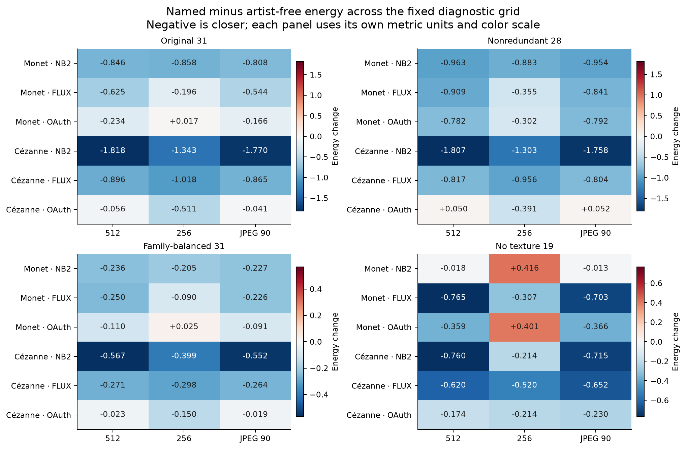
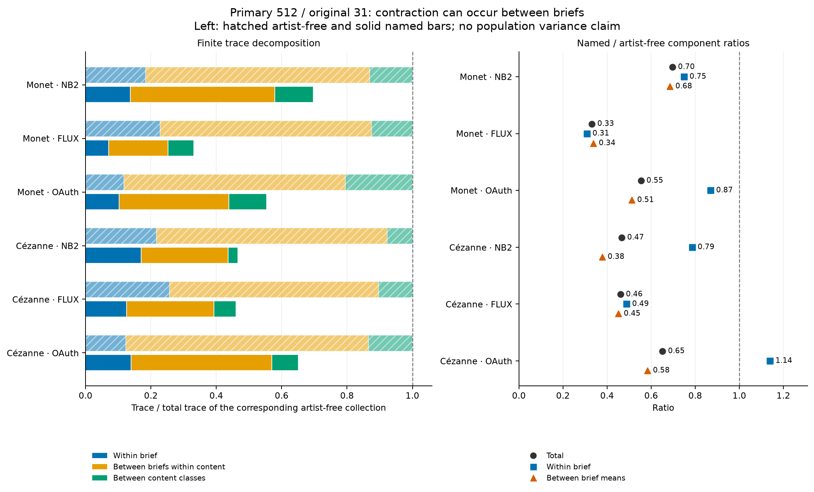
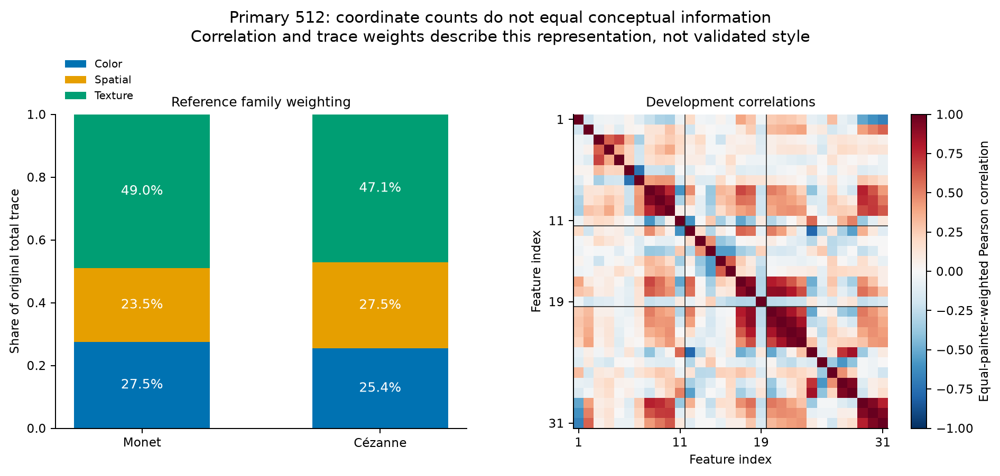
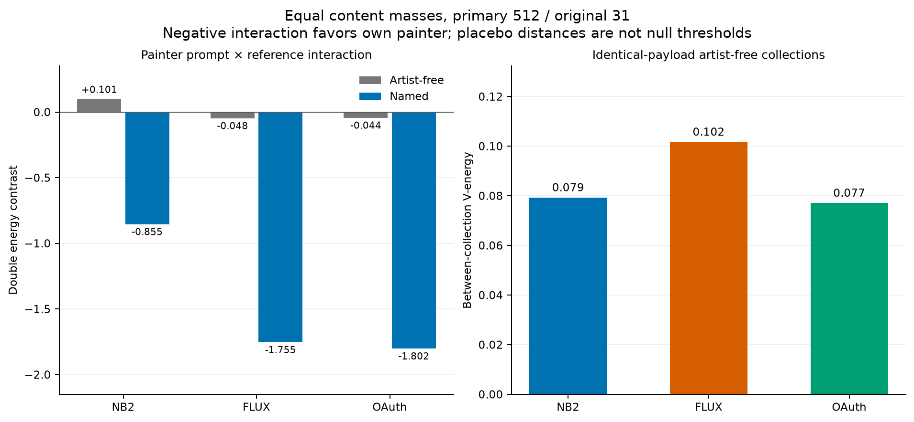
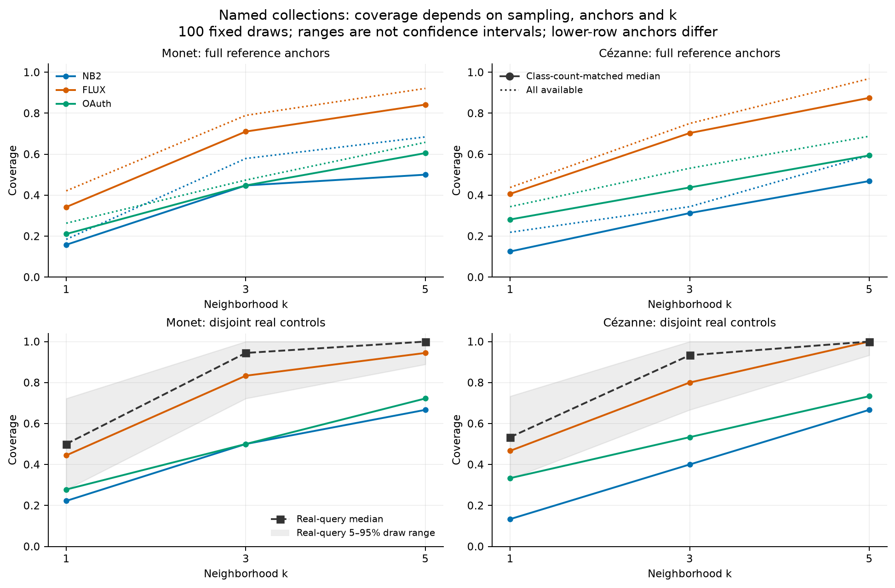
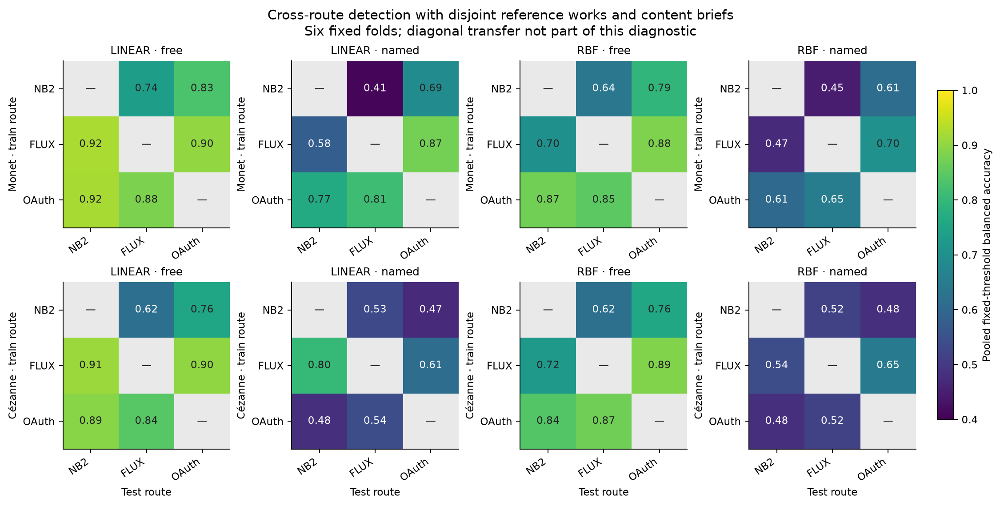

# Painter-distribution methodology revision: retained-data results

Run `pdrv1-numeric-20260907`. These are **post-result descriptive diagnostics** of the completed 70-reference/1,006-generation study. The original eight sharp-null prompt tests remain unchanged. No new images, pixel measurements, population confidence intervals, or confirmatory tests are introduced.

The revision supports a narrower account: painter naming changes finite feature distributions, often reducing differences between content briefs. The direction and magnitude of some effects depend on representation and reference choices. The evidence does not identify perceptual style diversity or eliminate geometry and capture confounding.

## Results that change the interpretation

Removing texture makes Nano Banana 2 Monet's primary named/original trace ratio **1.101**, above one. Its 256-pixel/no-texture named-minus-free energy is **+0.4159**, a direction reversal. FLUX retains negative energy changes across the fixed views and pipelines. Sensitivity variants are related summaries, not independent confirmations, and no new primary metric is selected.

All primary total named/free trace ratios are below one, while OAuth Cézanne's within-brief ratio is **1.139**. Lower aggregate variation therefore does not mean lower repeat-to-repeat variation for every fixed brief. Three repetitions per brief support empirical decomposition, not unbiased population variance components.

| Painter | Route | Energy change | Total trace ratio | Within brief | Between brief means |
| --- | --- | --- | --- | --- | --- |
| Monet | Nano Banana 2 | -0.8462 | 0.697 | 0.749 | 0.685 |
| Monet | FLUX.2 Max | -0.6246 | 0.331 | 0.309 | 0.337 |
| Monet | OAuth Image 2 service | -0.2339 | 0.554 | 0.870 | 0.512 |
| Cézanne | Nano Banana 2 | -1.8176 | 0.466 | 0.786 | 0.378 |
| Cézanne | FLUX.2 Max | -0.8956 | 0.460 | 0.489 | 0.451 |
| Cézanne | OAuth Image 2 service | -0.0561 | 0.651 | 1.139 | 0.583 |

The four panels have different metric units and independent color scales. Negative values mean lower energy to the same finite reference distribution; absolute magnitudes should not be ranked across panels. Every cell uses the unchanged development scale before its declared coordinate omission or family weighting.

Trace equals within-brief trace plus between-brief trace within content plus between-content trace. Original paintings have no brief labels and are decomposed only into within/between content. Energy includes twice the cross-domain mean distance minus both within-domain mean distances; those terms are exported separately.

## Reference influence and development scaling

Leave-one-work and source-proxy deletions retain the original content masses. Deleting a content class renormalizes the remaining masses and changes the target. These ranges summarize prescribed deletions; they are not confidence intervals. A source group is an exact recorded collection-ID set, including combined IDs; it is not a verified photographic capture workflow.

| Painter | Route | Deletion | Energy-change range | Unavailable |
| --- | --- | --- | --- | --- |
| Monet | NB2 | work | -0.9051 to -0.7980 | 0 |
| Monet | NB2 | content_class | -1.0371 to -0.5998 | 0 |
| Monet | NB2 | source_id | -1.0292 to -0.7932 | 0 |
| Monet | FLUX | work | -0.7145 to -0.5653 | 0 |
| Monet | FLUX | content_class | -0.8697 to -0.3983 | 0 |
| Monet | FLUX | source_id | -0.7671 to -0.5653 | 0 |
| Monet | OAuth | work | -0.3469 to -0.1569 | 0 |
| Monet | OAuth | content_class | -0.7376 to +0.3619 | 0 |
| Monet | OAuth | source_id | -0.5175 to -0.1657 | 0 |
| Cézanne | NB2 | work | -1.8959 to -1.7667 | 0 |
| Cézanne | NB2 | content_class | -2.1376 to -1.6875 | 0 |
| Cézanne | NB2 | source_id | -1.8959 to -1.7653 | 0 |
| Cézanne | FLUX | work | -0.9845 to -0.8441 | 0 |
| Cézanne | FLUX | content_class | -1.0074 to -0.6665 | 0 |
| Cézanne | FLUX | source_id | -0.9845 to -0.8145 | 0 |
| Cézanne | OAuth | work | -0.2223 to +0.0676 | 0 |
| Cézanne | OAuth | content_class | -0.2242 to +0.5942 | 0 |
| Cézanne | OAuth | source_id | -0.2223 to +0.0676 | 0 |

Development correlations and all four leave-one-development-painter IQR refits are exported. Refits use development works only. They change a measurement choice; they do not validate its artistic meaning. The original 31-coordinate view assigns repeated weight to some derived summaries and substantial variance to texture.

## Painter-label controls and specificity

The double contrast is E(A,A) + E(B,B) − E(A,B) − E(B,A), where the first index denotes the generated prompt painter and the second denotes the reference painter. Both reference-only and generated-only within-distribution terms cancel. All three content classes receive mass one third. Negative interaction favors own painter pairing in this feature geometry; it is not calibrated painter recognition.

| Route | Artist-free interaction | Named interaction | Identical-free V-energy |
| --- | --- | --- | --- |
| Nano Banana 2 | +0.1010 | -0.8551 | 0.0793 |
| FLUX.2 Max | -0.0481 | -1.7546 | 0.1017 |
| OAuth Image 2 service | -0.0443 | -1.8022 | 0.0772 |

For each route, 72 cross-label brief/repetition pairs have verified identical artist-free payloads: 216 pairs in total. Their separate collected distributions provide a post-result collection-label diagnostic. The nonzero V-energies have finite-sample baselines and are neither equivalence margins nor significance thresholds.

## Coverage and detection controls

Coverage is reported for k=1/3/5, all available images, uniform samples, and samples matching reference content counts at half and full reference N. The 100 fixed draws and per-reference radii/hits are retained. Uniform sample size matching does not match the painter-specific content composition.

The lower panels use identical anchors for disjoint real queries and generated queries at identical class counts. Those anchor panels differ from the upper panels. Full-panel matched query N is 38 Monet / 32 Cézanne; reduced anchor and query N is 18 Monet / 15 Cézanne. Their 5–95% draw ranges reuse the finite panel and are not population intervals. Coverage can saturate at larger k; coincident values at saturation do not establish distributional or perceptual equivalence. For OAuth Monet, the named/free coverage direction at k=3 changes between all-available and class-count-matched sampling; all conditions are retained in the tables.

| Kernel | Condition | Cross-route balanced-accuracy range |
| --- | --- | --- |
| LINEAR | artist_free | 0.618–0.924 |
| LINEAR | named | 0.410–0.874 |
| RBF | artist_free | 0.620–0.887 |
| RBF | named | 0.447–0.704 |

Transfer uses the fixed scaler, linear/RBF kernel, ridge 0.01, six whole-brief folds and disjoint original works. Each cell reports pooled fixed-threshold balanced accuracy; AUC is retained per fold, with its arithmetic mean labeled descriptive. Cross-route fixed-threshold balanced accuracy is lower for named than artist-free conditions in all 12 directions for each kernel. This is a threshold-performance result, not a uniform decline in ranking discrimination: mean within-fold AUC can rise. Threshold calibration and domain shift can contribute. Cross-route success alone would not isolate painter style because nuisance properties may transfer too.

For example, Monet FLUX→OAuth linear transfer has mean within-fold AUC 0.9534 → 0.9676 from artist-free to named, while its fixed-threshold balanced accuracy is 0.9035 → 0.8739. No pooled AUC is reported across the differently fitted fold scores.

The square metadata rule perfectly distinguishes all paid-route outputs from these originals: the paid outputs are square, and no reference is square. This is not proof that the feature classifier uses shape. Capture-workflow holdout remains explicitly unavailable. Original content coding is from one maintainer LLM; generated content labels describe intended prompts, not independently verified adherence. Descriptor associations do not correct these gaps.

## Execution sensitivities and preserved inference

The five timing views retain all selected images or exclude component-crossing groups, groups spanning over 120 seconds, technical-retry groups, or boundary plus retry groups. Spans refer to initial randomized groups; OAuth groups have three conditions. These post-result exclusions do not establish no interference or transform assigned windows into independent sessions.

| Endpoint | Painter | Route | Contrast | Five-view estimate range | Pairs |
| --- | --- | --- | --- | --- | --- |
| 0 | Monet | NB2 | artist_free → named | -0.8521 to -0.8462 | 71–72 |
| 1 | Cézanne | NB2 | artist_free → named | -1.8176 to -1.8176 | 72–72 |
| 2 | Monet | FLUX | artist_free → named | -0.6246 to -0.6246 | 72–72 |
| 3 | Cézanne | FLUX | artist_free → named | -0.8956 to -0.8938 | 71–72 |
| 4 | Monet | OAuth | artist_free → named | -0.2339 to -0.2339 | 72–72 |
| 5 | Cézanne | OAuth | artist_free → named | -0.0603 to -0.0561 | 71–72 |
| 6 | Monet | OAuth | generic_named → named | -0.0375 to -0.0375 | 72–72 |
| 7 | Cézanne | OAuth | generic_named → named | -0.2723 to -0.2723 | 70–70 |

The following adjusted p-values belong exclusively to the original frozen eight-endpoint family. They test the conditional sharp null of no prompt-assignment effect on availability and measured features under the fixed slot policy and no-interference assumption. They do not test original/generated population equality, reduced variance, perceptual similarity, or a mean-effect confidence interval.

| Endpoint | Painter | Route | Original contrast | Estimate | Original Holm p |
| --- | --- | --- | --- | --- | --- |
| 0 | Monet | NB2 | artist_free → named | -0.8462 | 0.0031 |
| 1 | Cézanne | NB2 | artist_free → named | -1.8176 | 8e-05 |
| 2 | Monet | FLUX | artist_free → named | -0.6246 | 8e-05 |
| 3 | Cézanne | FLUX | artist_free → named | -0.8956 | 8e-05 |
| 4 | Monet | OAuth | artist_free → named | -0.2339 | 0.19308 |
| 5 | Cézanne | OAuth | artist_free → named | -0.0561 | 1 |
| 6 | Monet | OAuth | generic_named → named | -0.0375 | 1 |
| 7 | Cézanne | OAuth | generic_named → named | -0.2723 | 0.0928 |

All initial dispositions and the exact technical retry are preserved. OAuth reported-quality differences remain part of the observed service outcome; removing treatment-associated low/medium quality differences would not automatically isolate a fixed-rendering semantic effect.

## Reproducibility, tables and remaining validation

All figures and CSV tables below derive solely from the sealed revision [analysis JSON](../../../data/manifests/painter_distribution_revision_v1/pdrv1-numeric-20260907/analysis.json). List memberships and exact payload checks remain there. CSV list-length columns end in `.n`; blank scalar fields mean unavailable/not applicable, never zero. Coverage draw tables retain all prescribed numeric draw outcomes without duplicating image payloads.

Input SHA-256: `a6596dadb63f2046f0498a754e5db4cf284c748c71337501f38f628e28908c34`.

| Table | Rows |
| --- | --- |
| [attempt_dispositions.csv](attempt_dispositions.csv) | 1009 |
| [availability.csv](availability.csv) | 1 |
| [cell_memberships.csv](cell_memberships.csv) | 48 |
| [coverage_draws.csv](coverage_draws.csv) | 16800 |
| [coverage_neighborhoods.csv](coverage_neighborhoods.csv) | 1470 |
| [coverage_summary.csv](coverage_summary.csv) | 210 |
| [cross_route_folds.csv](cross_route_folds.csv) | 288 |
| [cross_route_scores.csv](cross_route_scores.csv) | 5136 |
| [cross_route_transfer.csv](cross_route_transfer.csv) | 48 |
| [development_correlations.csv](development_correlations.csv) | 2883 |
| [development_scale_cells.csv](development_scale_cells.csv) | 56 |
| [development_scale_contrasts.csv](development_scale_contrasts.csv) | 24 |
| [development_scales.csv](development_scales.csv) | 124 |
| [heldout_real_controls.csv](heldout_real_controls.csv) | 42 |
| [heldout_real_draws.csv](heldout_real_draws.csv) | 4200 |
| [heldout_reference_designs.csv](heldout_reference_designs.csv) | 2 |
| [identical_payload_placebos.csv](identical_payload_placebos.csv) | 36 |
| [metadata_counts.csv](metadata_counts.csv) | 160 |
| [metadata_descriptor_ranges.csv](metadata_descriptor_ranges.csv) | 128 |
| [metadata_feature_associations.csv](metadata_feature_associations.csv) | 1448 |
| [metadata_square_rule.csv](metadata_square_rule.csv) | 14 |
| [metric_cells.csv](metric_cells.csv) | 168 |
| [original_endpoints.csv](original_endpoints.csv) | 8 |
| [prompt_contrasts.csv](prompt_contrasts.csv) | 72 |
| [reference_influence.csv](reference_influence.csv) | 396 |
| [specificity_interactions.csv](specificity_interactions.csv) | 108 |
| [specificity_matrices.csv](specificity_matrices.csv) | 288 |
| [study_accounting.csv](study_accounting.csv) | 1 |
| [timing_contrasts.csv](timing_contrasts.csv) | 40 |
| [timing_groups.csv](timing_groups.csv) | 432 |
| [trace_contributions.csv](trace_contributions.csv) | 10080 |

The [revision protocol](../../../studies/painter_distribution_revision_v1/PROTOCOL.md) declared this bounded diagnostic grid after the original results and before this full package was computed. The original 14 primary energy/trace/IQR cells and six corresponding original-view prompt changes reproduce within the recorded bridge tolerance; the original calculation itself reproduces exactly. The remaining two original generic/detailed endpoints are preserved and replayed by the timing all-selected view.

This scope makes no new generation call. The next scientific requirements for a stronger claim are reference/source/geometry common support and independent human assessment of both painter resemblance and variation across multiple image sets. Those validations have not occurred. A new encoder would be complementary measurement, not automatic ground truth. The methodological review and follow-up checks were maintainer-run LLM reviews, not independent human or institutional peer review.

Numerical replay, pixel-to-feature replay and service regeneration are separate promises. These compact artifacts support numerical replay; ignored image bytes and the environment are needed for pixel replay, and mutable service aliases prevent a guarantee of exact regeneration.
