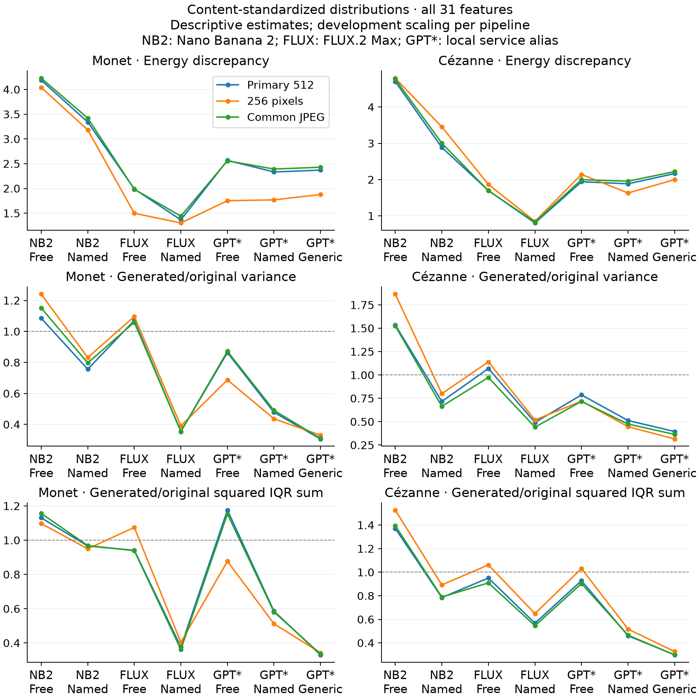
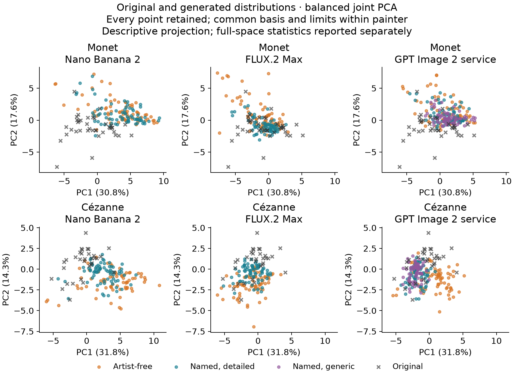
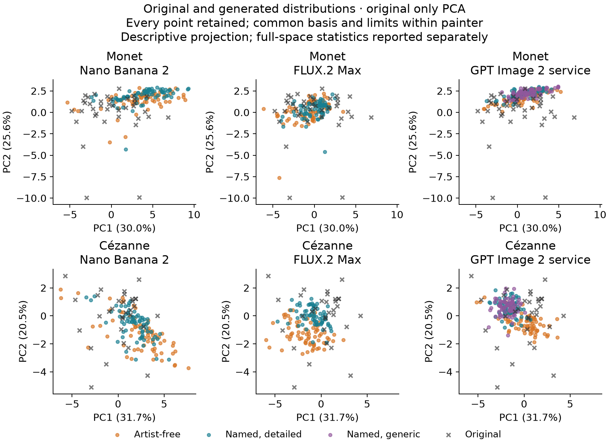
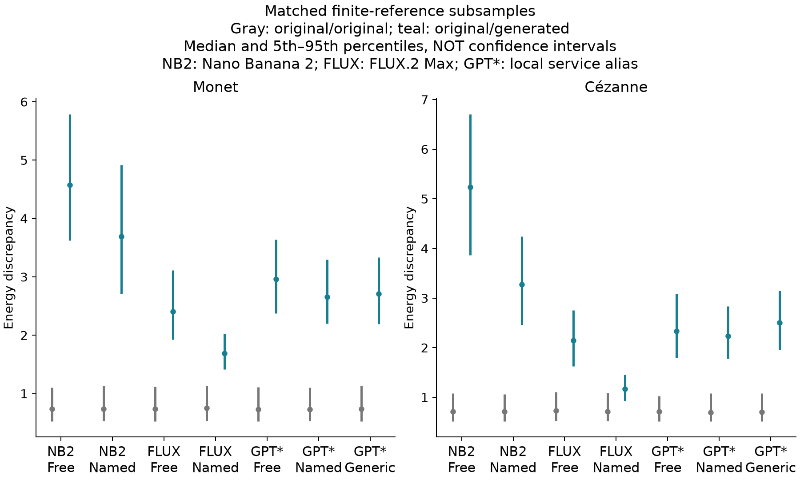
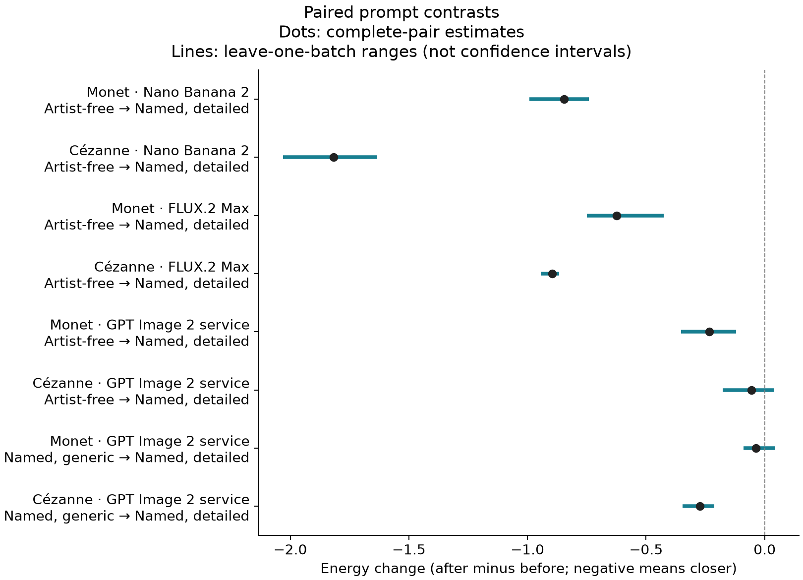

# Controlled painter-distribution results

Execution: `pdsv1-main-immediate-20260907`; status **completed**. Terminal slots: 1008/1,008. Dispositions: `{"http_error": 2, "image_returned": 1006}`.

Conservative study accounting including pilot, retries and reserves: $45.6819185; 1027 attempts, 589 paid. Provider-reported charges: $40.6819185. Retained failed-call contingency: $5.00 for 1 cost-omitting failed calls. Unresolved intents: 0; unclassified uncertainty: 0.

Analysis publication `pdsv1-analysis-20260907` converts only NumPy rejection flags to native JSON Booleans, with exact value equality. The frozen statistical calculation and every endpoint remain unchanged.

Three concurrent route workers use at most one call per route, with globally recorded starts at least five seconds apart. Actual timing and availability remain part of the evidence. GPT Image 2 is a local service alias, not an attested snapshot.

The derived view retains three closed predecessors: 48 initial outcomes (47 images and one OAuth refusal), 52 initial outcomes (51 images and one FLUX 502), and 405 recovery outcomes (404 new images and the successful bound FLUX retry). A fourth census collects the remaining 504 untouched slots. No prior success or OAuth-refused slot was generated again.

At the user's request, batches 4–7 run consecutively rather than waiting for the original night schedule. This change preceded all generated-feature measurement. Original assignment IDs and actual timestamps are retained; the original 33-hour schedule was not executed in full. Assigned batches do not establish independent backend sessions. The complete FLUX failure retains its missing reported cost and $5 contingency; the documented billing waiver is not substituted for an individual invoice.

The primary comparison uses all 31 features, the fixed historical development scaler, and generated content masses matched to each finite reference panel. Original works receive equal weight. These are distribution comparisons, not distances solely to an artist mean. Energy, spread, coverage and detection are descriptive; they do not establish aesthetic quality or oeuvre equivalence.

## Primary distribution comparisons

| Painter | Route | Condition | Original / generated | Energy | Variance ratio | Squared IQR sum ratio |
|---|---|---|---:|---:|---:|---:|
| Monet | Nano Banana 2 | Artist-free | 38 / 72 | 4.1880 | 1.0855 | 1.1309 |
| Monet | Nano Banana 2 | Named, detailed | 38 / 72 | 3.3418 | 0.7563 | 0.9661 |
| Monet | FLUX.2 Max | Artist-free | 38 / 72 | 1.9898 | 1.0707 | 0.9410 |
| Monet | FLUX.2 Max | Named, detailed | 38 / 72 | 1.3651 | 0.3542 | 0.3772 |
| Monet | GPT Image 2 service | Artist-free | 38 / 72 | 2.5669 | 0.8633 | 1.1756 |
| Monet | GPT Image 2 service | Named, detailed | 38 / 72 | 2.3330 | 0.4781 | 0.5860 |
| Monet | GPT Image 2 service | Named, generic | 38 / 72 | 2.3704 | 0.3061 | 0.3298 |
| Cézanne | Nano Banana 2 | Artist-free | 32 / 72 | 4.7037 | 1.5353 | 1.3709 |
| Cézanne | Nano Banana 2 | Named, detailed | 32 / 72 | 2.8861 | 0.7158 | 0.7849 |
| Cézanne | FLUX.2 Max | Artist-free | 32 / 72 | 1.6998 | 1.0690 | 0.9504 |
| Cézanne | FLUX.2 Max | Named, detailed | 32 / 72 | 0.8042 | 0.4922 | 0.5673 |
| Cézanne | GPT Image 2 service | Artist-free | 32 / 72 | 1.9405 | 0.7865 | 0.9276 |
| Cézanne | GPT Image 2 service | Named, detailed | 32 / 72 | 1.8845 | 0.5123 | 0.4607 |
| Cézanne | GPT Image 2 service | Named, generic | 32 / 70 | 2.1657 | 0.3946 | 0.2988 |



Each processing sensitivity has its own scaler fitted to the same 221 development works. Comparisons across pipelines assess processing sensitivity, not calibrated aesthetic change. Family and content-weighting sensitivities are retained in `cells.csv`.

## Scatter plots and distribution diagnostics





Every image is retained. PCA is fitted once per painter with half the weight on originals and half shared across seven generated cells; the original-only basis is a projection sensitivity. The classifiers operate on full features and hold out entire briefs or assigned batches and disjoint original works. `classifiers.csv` retains scores, predictions and split membership. Separability alone does not isolate style.



Subsample ranges reflect resampling of this finite collection, not population confidence intervals. `coverage.csv` retains k=3 original-neighborhood coverage for all available images and equal-size generated subsets. `specificity.csv` compares named outputs against both painters under equal content masses.

## Paired prompt contrasts

| Painter | Route | Before → after | Pairs | Energy change | Raw p | Holm p |
|---|---|---|---:|---:|---:|---:|
| Monet | Nano Banana 2 | Artist-free → Named, detailed | 72 | -0.8462 | 0.00062 | 0.0031 |
| Cézanne | Nano Banana 2 | Artist-free → Named, detailed | 72 | -1.8176 | 1e-05 | 8e-05 |
| Monet | FLUX.2 Max | Artist-free → Named, detailed | 72 | -0.6246 | 1e-05 | 8e-05 |
| Cézanne | FLUX.2 Max | Artist-free → Named, detailed | 72 | -0.8956 | 1e-05 | 8e-05 |
| Monet | GPT Image 2 service | Artist-free → Named, detailed | 72 | -0.2339 | 0.06436 | 0.19308 |
| Cézanne | GPT Image 2 service | Artist-free → Named, detailed | 72 | -0.0561 | 0.61624 | 1 |
| Monet | GPT Image 2 service | Named, generic → Named, detailed | 72 | -0.0375 | 0.773 | 1 |
| Cézanne | GPT Image 2 service | Named, generic → Named, detailed | 70 | -0.2723 | 0.0232 | 0.0928 |



Negative change means the after condition is closer on the matched measured pairs. Eight prospectively fixed endpoints use 99,999 Monte Carlo sign draws and Holm adjustment. The conditional sharp null concerns availability and features under the fixed slot/retry policy, with no interference. Shared service state and concurrent gateway traffic can violate that assumption. Unavailable endpoints remain in the family with p=1. Leave-batch and leave-brief ranges are descriptive, not confidence intervals.

## Scope and reproduction

The reference panel has 38 Monet and 32 Cézanne works. Its visual content coding was performed by one maintainer LLM, not independent human experts. Digital capture, encoding, residual composition and service identity remain possible explanations. No human assessment or learned-feature validation is claimed.

Full-precision tables retain unavailable rows, excluded pairs, coefficients, classification membership and subsample draws. Frozen scientific and execution inputs, raw-response hashes and terminal receipts remain under the study manifest directory.

```bash
uv run --locked --extra analysis python -m latent_art_bench.painter_distribution_study_v1.analysis_publication check
uv run --locked --extra analysis python -m latent_art_bench.painter_distribution_study_v1.main_report check
```
