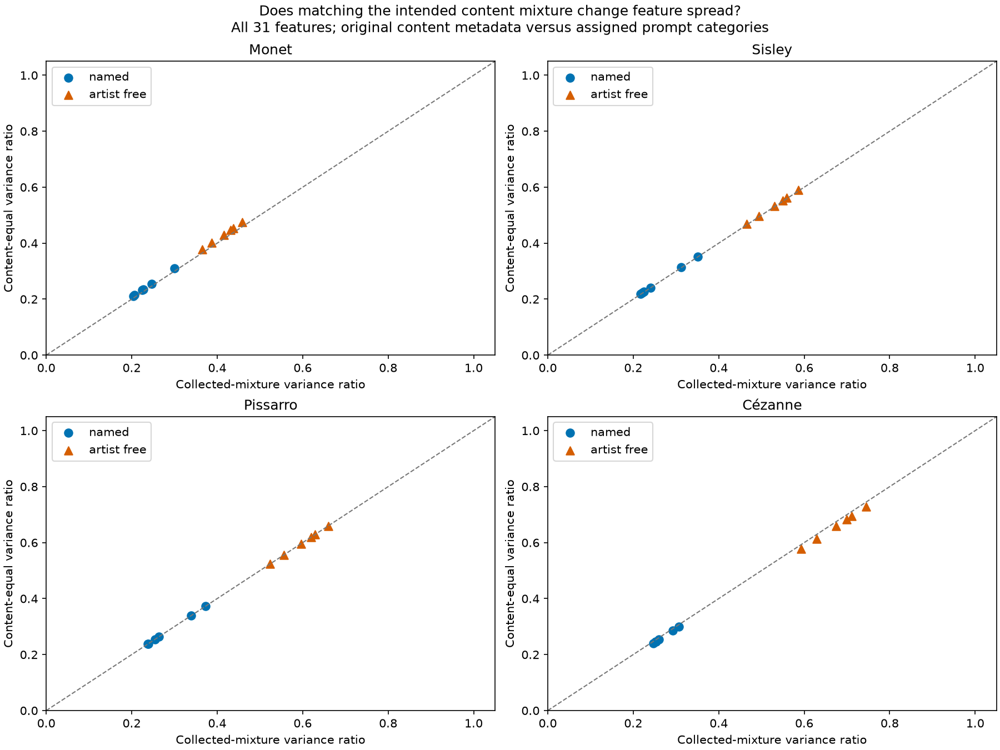
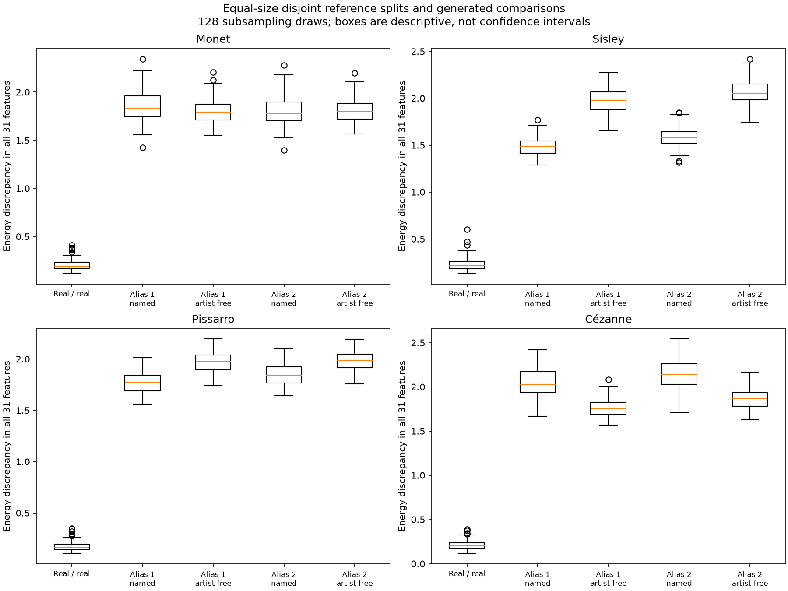
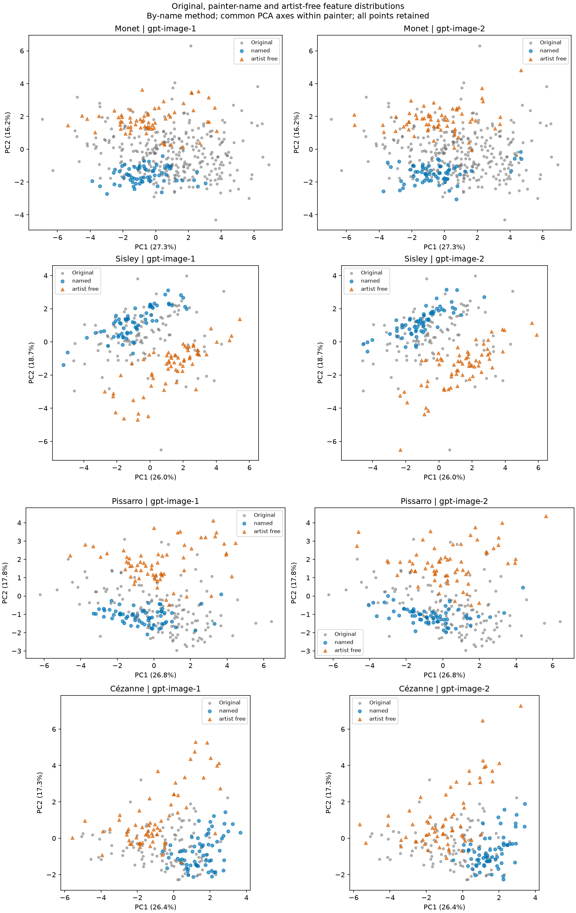

# Existing-data explanation of painter-feature distribution gaps

Stage A of Painter Distribution Study v1. Post-hoc numeric diagnostics; no new images, image opening, feature extraction, generation, or human ratings.

## Findings

| Condition | Collected variance ratio | Content-equal variance ratio | Squared-IQR spread ratio | RBF balanced accuracy |
| --- | --- | --- | --- | --- |
| named | 0.206-0.376 | 0.211-0.372 | 0.215-0.396 | 0.940-0.983 |
| artist_free | 0.369-0.750 | 0.378-0.728 | 0.352-0.646 | 0.915-0.990 |

Ranges span all four painters, two aliases and three prompt methods. Ordinary sample variance and weighted population variance have different finite-N denominators; the content plot compares population definitions on both axes.



## Sample-size baseline

| Painter | Equal group size | Real/real median energy | Named median energy | Artist-free median energy |
| --- | ---: | ---: | ---: | ---: |
| Monet | 64 | 0.1932 | 2.0683 | 1.7319 |
| Sisley | 53 | 0.2149 | 1.6776 | 1.8779 |
| Pissarro | 64 | 0.1635 | 1.9745 | 1.8537 |
| Cézanne | 52 | 0.1989 | 2.1419 | 1.6570 |

The generated medians pool aliases and methods descriptively; the figure shows by-name cells separately. Draws reuse the corpus and are not independent experiments.



## Distribution geometry



PCA is descriptive and unsupervised. Full-space classifiers are fixed and evaluated on held-out scene families and original works. The two service aliases do not attest two distinct model snapshots.

## Transfer diagnostics

| Transfer | Classifier | Balanced accuracy range | Median |
| --- | --- | ---: | ---: |
| cross_painter | linear | 0.516-0.952 | 0.839 |
| cross_painter | rbf | 0.500-0.944 | 0.828 |
| cross_alias | linear | 0.949-0.973 | 0.956 |
| cross_alias | rbf | 0.947-0.983 | 0.965 |

Transfer excludes target scene families from training and holds out physical works. A transferable detector is compatible with generic synthetic/capture signatures; it does not show that painter-specific cues are absent.

## Interpretation and next stage

The content adjustment uses recorded original categories and assigned prompt categories. Actual depicted content and viewpoint were not independently annotated. Consequently it is a mixture sensitivity, not a completed content-matched validation. The four broad categories cannot remove all composition differences. Capture remains unresolved; collection identifiers do not demonstrate independent photographic events.

No p-values, population confidence intervals, artistic-equivalence margin or aesthetic ranking is asserted. Source counts, all family effects, individual subsampling draws, split membership and held-out predictions are retained. The new reference and endpoint audit is required before the prospective generation stage.

[Fixed methods](../../../studies/painter_distribution_study_v1/DIAGNOSTICS.md). Run from the repository root:

```bash

uv run --locked --extra analysis --extra learned python -m latent_art_bench.painter_distribution_study_v1.diagnostics check

```

Validation is performed by the maintainer agent, without institutional independence.
