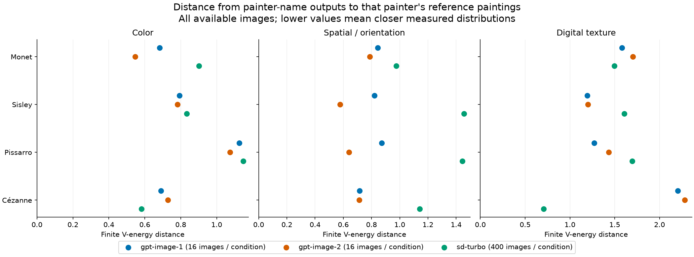
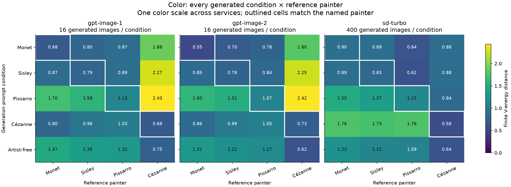
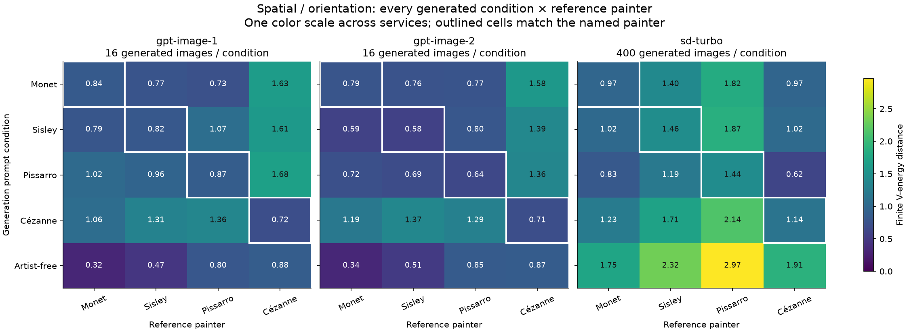
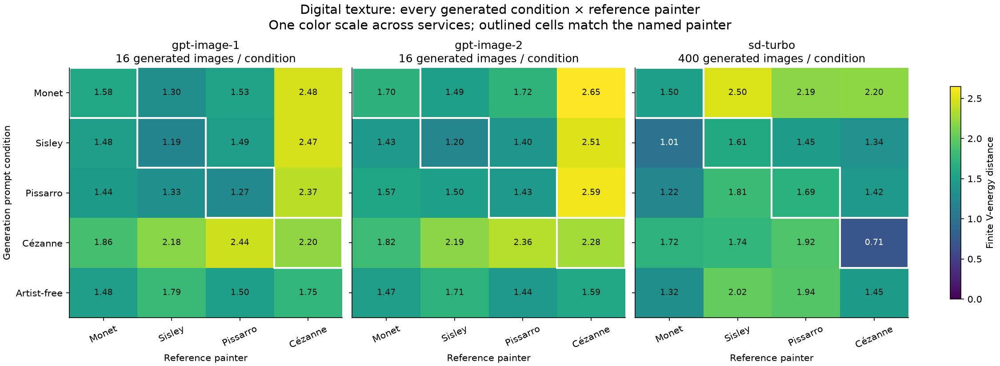
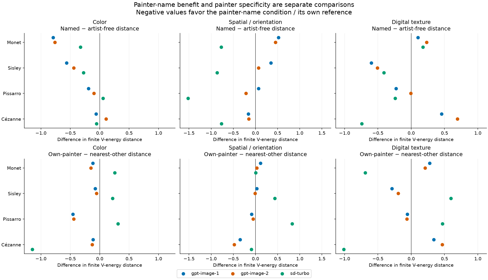
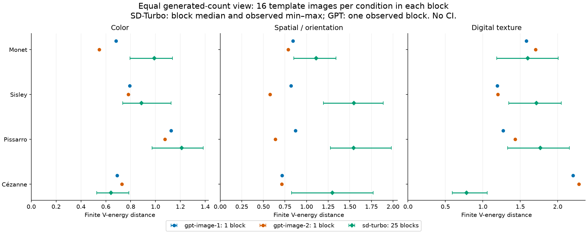
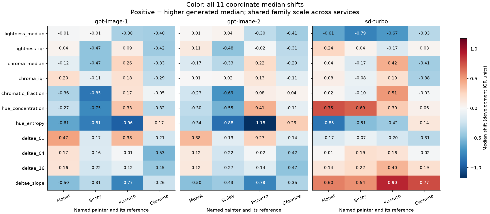
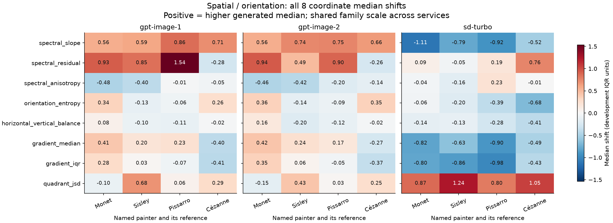
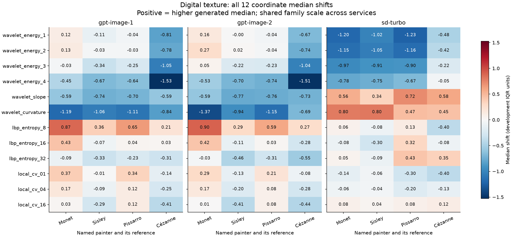

# Generated-image feature distances from painters' reference paintings

This analysis measures how far the existing generated-image distributions are from the existing reference paintings in 31 interpretable features. The table below gives the complete own-painter distances, using all available images. Smaller values mean closer measured distributions within the same feature family. Each service–painter–family comparison is retained; there is no combined model score or overall ranking.

| Reference painter | Feature family | gpt-image-1 | gpt-image-2 | sd-turbo |
| --- | --- | --- | --- | --- |
| Monet | Color | 0.6827 | 0.5468 | 0.9016 |
| Monet | Spatial / orientation | 0.8434 | 0.7872 | 0.9749 |
| Monet | Digital texture | 1.5800 | 1.7033 | 1.4964 |
| Sisley | Color | 0.7927 | 0.7812 | 0.8325 |
| Sisley | Spatial / orientation | 0.8204 | 0.5760 | 1.4560 |
| Sisley | Digital texture | 1.1942 | 1.2013 | 1.6071 |
| Pissarro | Color | 1.1261 | 1.0748 | 1.1475 |
| Pissarro | Spatial / orientation | 0.8721 | 0.6400 | 1.4440 |
| Pissarro | Digital texture | 1.2708 | 1.4319 | 1.6945 |
| Cézanne | Color | 0.6905 | 0.7285 | 0.5813 |
| Cézanne | Spatial / orientation | 0.7155 | 0.7129 | 1.1428 |
| Cézanne | Digital texture | 2.2039 | 2.2831 | 0.7053 |



## Data and estimand

This is a post-hoc descriptive analysis of already exposed v2 features, authorized to reuse the existing painters, generated images and feature definitions. It does not reopen confirmation as a new holdout. The original stage evidence remains unchanged. The frozen shared measurement method is `pfg2-method-20260905`.

| Reference painter | Measured confirmation works |
| --- | --- |
| Monet | 297 |
| Sisley | 106 |
| Pissarro | 141 |
| Cézanne | 105 |

| Requested service | Monet | Sisley | Pissarro | Cézanne | Artist-free |
| --- | --- | --- | --- | --- | --- |
| gpt-image-1 | 16 | 16 | 16 | 16 | 16 |
| gpt-image-2 | 16 | 16 | 16 | 16 | 16 |
| sd-turbo | 400 | 400 | 400 | 400 | 400 |

Each reference work receives equal weight within its painter; each generated image receives equal weight within its service and prompt condition. Unequal reference and generation counts are retained. These are finite observed distributions, not probability samples of each painter's oeuvre or all outputs of an underlying model.

The corpus consists of Wikidata-declared outdoor-place paintings and measured digital surrogates delivered through Wikimedia Commons. Attribution, object/media eligibility and outdoor-place selection derive from the recorded metadata rules. This is not an independent museum-level verification of attribution. Measurement succeeded for 649 confirmation works after recorded acquisition and normalization attrition; failed attempts remain in the original ledgers.

For each coordinate, `z = (feature − frozen development median) / frozen development IQR`. The equal-painter scaler was fitted to 221 new-development works, excluding historical development and confirmation. It is reused without refitting. Euclidean distances are calculated separately in color (11 coordinates), spatial/orientation (8), and digital texture (12). No dimension normalization or family aggregation is used; absolute values should therefore not be compared across families.

For transformed reference vectors `x₁ … xₙ` and generated vectors `y₁ … yₘ`, the reported finite V-energy statistic is:

```text
Dᵥ(X,Y) = 2/(nm) ΣᵢΣⱼ ||xᵢ − yⱼ||₂
          − 1/n² ΣᵢΣₖ ||xᵢ − xₖ||₂
          − 1/m² ΣⱼΣₗ ||yⱼ − yₗ||₂
```

Both within-distribution sums include the zero diagonal terms. This is the energy statistic itself (sometimes called squared energy distance), without a square root. It compares both location and distributional spread, rather than only centroids. Zero denotes identical empirical feature distributions under this metric. Positive values have no calibrated equivalence cutoff. When interpreted as a population estimator, its finite-sample bias depends on sample sizes and dispersion; sample-size differences prevent interpreting small pooled cross-service gaps as general model gains.

## Complete generated-condition × reference matrices

Every painter-name condition and the matched artist-free condition is compared with all four references. White outlines mark own-painter cells. Each family has one color scale across services. Matrix numbers are rounded only for display; exports retain full numerical precision.







## Artist-free benefit and painter specificity

`control_difference = own-painter distance − artist-free distance to the same painter`. A negative value describes closer fit after adding that painter's name. `specificity_margin = own-painter distance − distance to the nearest other painter`. A negative value means the named condition is closer to its own reference than to each of the three other references. Neither comparison establishes equivalence.

| Service | Family | Closer than artist-free | Own reference strictly closest |
| --- | --- | --- | --- |
| gpt-image-1 | Color | 4/4 | 4/4 |
| gpt-image-1 | Spatial / orientation | 1/4 | 2/4 |
| gpt-image-1 | Digital texture | 2/4 | 2/4 |
| gpt-image-2 | Color | 3/4 | 4/4 |
| gpt-image-2 | Spatial / orientation | 2/4 | 3/4 |
| gpt-image-2 | Digital texture | 2/4 | 2/4 |
| sd-turbo | Color | 3/4 | 1/4 |
| sd-turbo | Spatial / orientation | 4/4 | 1/4 |
| sd-turbo | Digital texture | 3/4 | 2/4 |

Counts above summarize the four painters within each family; ties do not count as strict improvement. They are descriptive signs, without significance tests or multiplicity-adjusted claims. All individual differences and nearest-other identities are available in [contrasts.csv](contrasts.csv).



## Equal generated-count diagnostic

Each SD-Turbo repetition block contains the same 16 templates for every condition; each GPT alias has one such block. Recomputing distances for each complete SD-Turbo block uses 16 generated images per condition for every service. All 25 SD-Turbo blocks are retained. Points are block medians and whiskers span the observed minimum to maximum; a GPT point is its single observed block. These ranges are **not confidence intervals**. The reference counts still differ by painter, and service settings, output geometry and repeated sampling differ. This diagnostic does not create a population-level ranking. A median of block distances need not equal the distance computed from all 400 pooled SD-Turbo images.



## Coordinate diagnostics: all 31 features

Every named-painter coordinate is shown, without feature selection. Values are generated median minus reference median after the frozen transform, so a value of +1 means a higher generated median by one development IQR. This signed diagnostic is separate from multivariate distance; compensating shifts cannot be summed into an overall fit score. [coordinates.csv](coordinates.csv) also contains generated / reference IQR ratios. Ratios above one indicate greater generated dispersion in that coordinate; an empty ratio means the reference IQR is zero and division is undefined.







## Distances between the reference painters

These comparisons use the same frozen transform and V-energy formula. They show how separated the four observed reference distributions are in each family. They are context, not a tolerance threshold or an independent-capture noise floor.

| First painter | Second painter | Color | Spatial / orientation | Digital texture |
| --- | --- | --- | --- | --- |
| Monet | Sisley | 0.1300 | 0.0845 | 0.2899 |
| Monet | Pissarro | 0.2160 | 0.3244 | 0.1669 |
| Monet | Cézanne | 0.7451 | 0.4400 | 0.6526 |
| Sisley | Pissarro | 0.1248 | 0.1835 | 0.2306 |
| Sisley | Cézanne | 0.7325 | 0.4867 | 0.4885 |
| Pissarro | Cézanne | 0.7839 | 0.4521 | 0.6937 |

## Interpretation limits

SD-Turbo refers to the pinned revision recorded in the original freeze. `gpt-image-1` and `gpt-image-2` identify requested OAuth service aliases: neither response attested an underlying model snapshot. GPT responses reported low quality and variable, mostly landscape dimensions, despite requested 1024×1024 / medium settings. SD-Turbo generated 512×512 squares. Comparisons therefore describe observed services under their actual recorded behavior.

Subject content, composition, aspect ratio, source workflows, color profiles and digital reproduction can affect these measurements. The painters' outdoor-place content mixes differ. Digital texture measures do not measure physical brushwork, and these features do not isolate content-free style, authorship, intention, or artistic quality. Existing paired crop sensitivity and source/profile diagnostics remain in the original empirical report; this extension does not retune the features or regenerate those sealed analyses.

Independent capture calibration is unnecessary to describe the observed feature distances. It is needed to separate capture disturbance from painter differences and support a calibrated reproduction/equivalence claim. No such threshold is inferred here. No confidence intervals are newly computed: the original repeated-block nominal intervals were exploratory because synthetic shift calibration covered only 86% at a nominal 95% level. Historical neutral reviews were maintainer-run LLM review subagents, not institutionally independent reviews.

## Reproduction and exports

Run from the repository root with the locked analysis dependencies. Each build needs a new output directory; an existing report is never overwritten.

```bash
uv run --locked --extra analysis --extra learned latent-art-bench feature-distances build \
  --method-id pfg2-method-20260905 \
  --output tmp/feature-distance-reproduction
uv run --locked --extra analysis --extra learned latent-art-bench feature-distances check \
  --output tmp/feature-distance-reproduction
```

The build reads sealed numeric feature records and their provenance. It performs no image acquisition, image reading, feature extraction, or generation requests. [analysis.json](analysis.json) contains the full result and [provenance.json](provenance.json) records the inputs and exported artifacts. Figures are provided as PNG and SVG; [distances.csv](distances.csv), [contrasts.csv](contrasts.csv), [coordinates.csv](coordinates.csv), [reference_distances.csv](reference_distances.csv), [block_distances.csv](block_distances.csv) and [block_summary.csv](block_summary.csv) retain every comparison.

Original completed report (repository-relative): `reports/painter_feature_generation_v2/EMPIRICAL_ANALYSIS.md`. Input SHA-256 bindings are retained in the exported provenance, separately from the existing experiment's immutable evidence.
