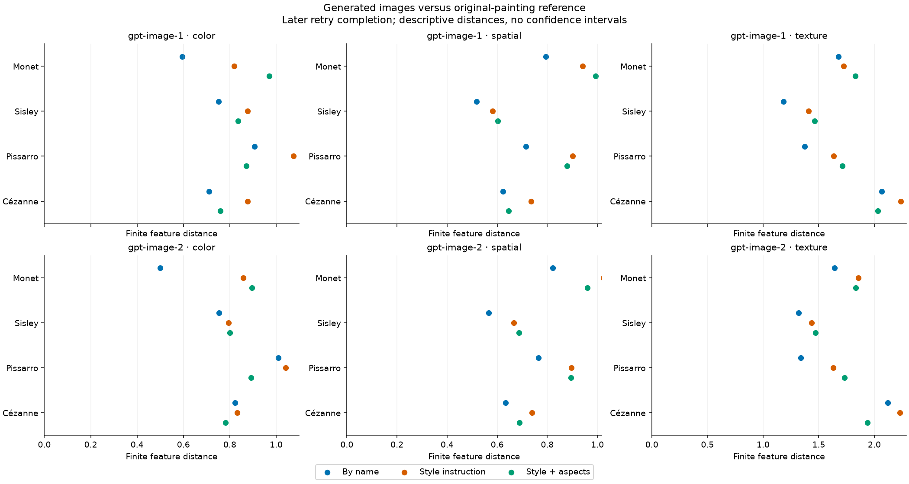

# Main distance results after two authorized retry attempts

**1,920 measured images** in the derived 1,920-slot grid; 2 newly measured retry images. Exactly two additional requests were authorized, one for each original refusal. Original records remain unchanged.

These are **post-hoc descriptive results**. The original complete-grid primary remains unavailable: the later retry images were not generated in their original randomized request positions. No new randomization p-values or confidence intervals are asserted.

The comparison retains the same 649 painting surrogates, 221-work development scaler, 31 color/spatial/digital-texture features and 512-short-side normalization. Every scene has weight 1/16; with all four outputs present each image has weight 1/64. Smaller V-energy means closer finite feature distributions within the same feature family. Family magnitudes are not comparable to each other.



## gpt-image-1

| Painter | Family | By name | Style instruction | Style + aspects |
| --- | --- | --- | --- | --- |
| Monet | color | 0.594807 | 0.819460 | 0.969860 |
| Monet | spatial | 0.794369 | 0.941634 | 0.992551 |
| Monet | texture | 1.677220 | 1.723332 | 1.827766 |
| Sisley | color | 0.752501 | 0.876228 | 0.834934 |
| Sisley | spatial | 0.516767 | 0.581711 | 0.602443 |
| Sisley | texture | 1.185075 | 1.408915 | 1.464135 |
| Pissarro | color | 0.907385 | 1.074494 | 0.871587 |
| Pissarro | spatial | 0.715293 | 0.901899 | 0.879462 |
| Pissarro | texture | 1.372915 | 1.635911 | 1.712301 |
| Cézanne | color | 0.710458 | 0.877524 | 0.759141 |
| Cézanne | spatial | 0.622790 | 0.735343 | 0.645043 |
| Cézanne | texture | 2.064635 | 2.236078 | 2.031355 |
## gpt-image-2

| Painter | Family | By name | Style instruction | Style + aspects |
| --- | --- | --- | --- | --- |
| Monet | color | 0.500389 | 0.858441 | 0.895264 |
| Monet | spatial | 0.822085 | 1.023589 | 0.960472 |
| Monet | texture | 1.641915 | 1.857634 | 1.831812 |
| Sisley | color | 0.752910 | 0.795141 | 0.800438 |
| Sisley | spatial | 0.566496 | 0.666875 | 0.686649 |
| Sisley | texture | 1.320115 | 1.436312 | 1.470873 |
| Pissarro | color | 1.009621 | 1.040402 | 0.890898 |
| Pissarro | spatial | 0.765335 | 0.896163 | 0.894614 |
| Pissarro | texture | 1.337881 | 1.631206 | 1.730829 |
| Cézanne | color | 0.823220 | 0.831955 | 0.781367 |
| Cézanne | spatial | 0.634114 | 0.739055 | 0.688606 |
| Cézanne | texture | 2.119113 | 2.228933 | 1.936714 |
## Observed comparisons

By-name prompting has smaller distance than explicit style instruction in **24/24 comparisons**. Adding aspects decreases distance in 13/24 comparisons. These directions are descriptions, not claims of statistical significance.

Requested aliases do not attest model snapshots. Returned size/quality differences, scene content, digital capture and service drift can affect distances. The 649 references are exposed digital surrogates, not a probability sample of entire oeuvres. This report does not rank aesthetic quality or establish reproduction/equivalence.

All earlier exploratory tests and their assumptions remain in the separate [pre-retry supplement](../../painter_prompt_supplement_v1/ppss1-missingness-20260905/REPORT.md). Its tests are not reassigned to this completed grid.

## Reproduction and exports

- [distances](distances.csv)
- [absolute](absolute.csv)
- [contrasts](contrasts.csv)
- [control_comparisons](control_comparisons.csv)
- [changes](changes.csv)
- [availability](availability.csv)

Full precision is retained in CSV and analysis JSON. Changes include every altered distance cell relative to the earlier equal-scene-weighted supplement.

```bash
uv run --locked --extra analysis --extra learned python -m latent_art_bench.painter_prompt_retry_v1 check
```
