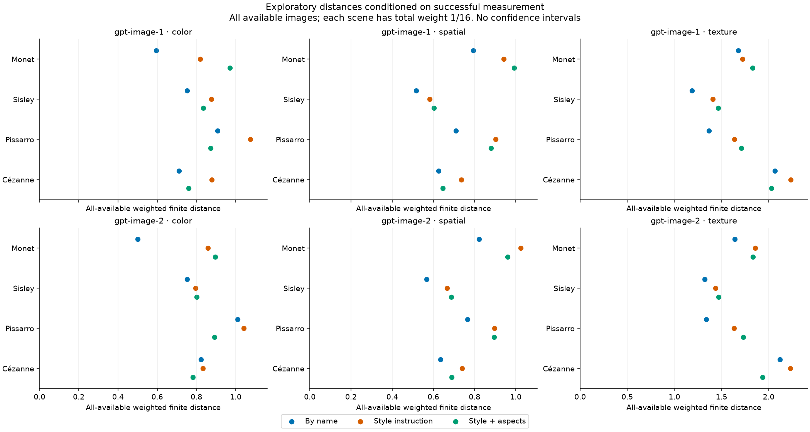
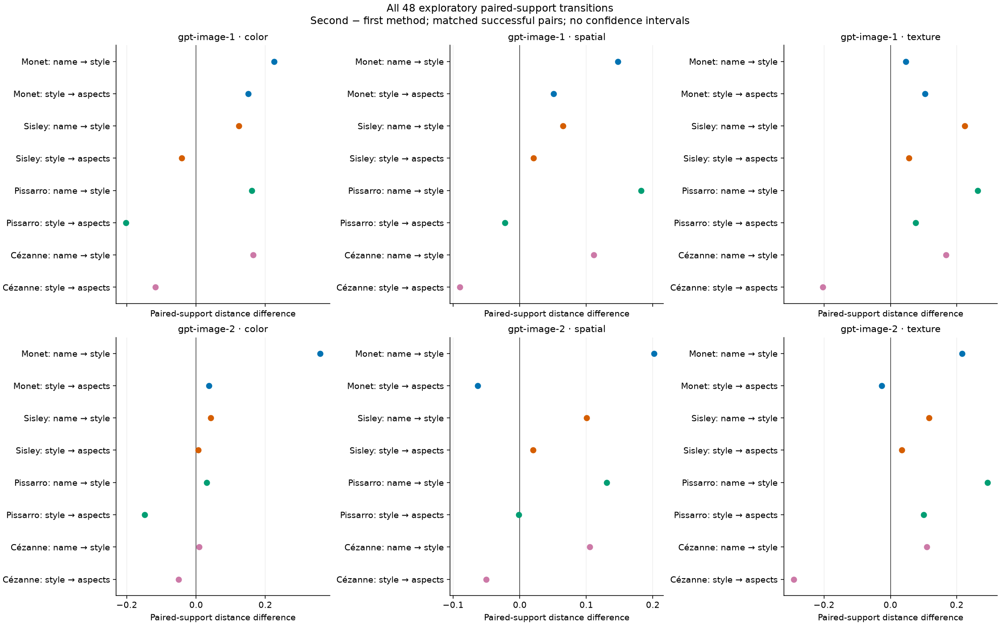
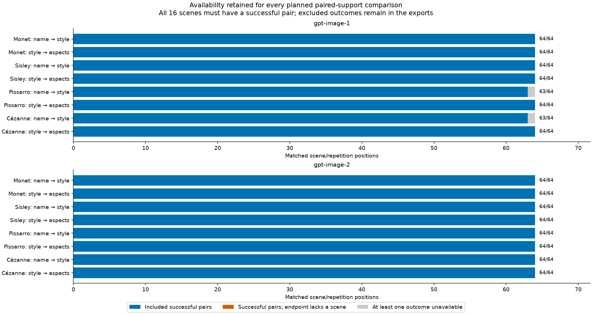

# Missingness supplement: exploratory painter-feature distances

**The original registered primary analysis remains unavailable because its required complete measured grid is missing.** This separate supplement was specified after the first service refusal and before new-image feature measurement. It is exploratory and was not preregistered before generation; it does not replace, repair or relabel the original primary result.

| Record | Value |
| --- | --- |
| Supplement | ppss1-missingness-20260905 |
| Source generation | pps1-gpt-prompts-20260905 |
| Original primary status | unavailable_incomplete_grid |
| Exploratory endpoints | 48 available; 0 unavailable; 48 retained |
| Repetitions | 4 |

## Distances conditioned on successful measurement

These descriptive distances use every successfully measured output in each method/condition. A scene with mₜ available images gives each image weight 1/(16 mₜ), so every scene retains total weight 1/16. Every one of the 16 scenes must be represented; an unsupported endpoint is shown as unavailable. This conditions on success and does not describe missing potential outputs.

For a family of scaled features, the reported V-energy is D = (2/N) Σᵢⱼ wⱼ ‖xᵢ − yⱼ‖₂ − (1/N²) Σᵢₖ ‖xᵢ − xₖ‖₂ − Σⱼₗ wⱼwₗ ‖yⱼ − yₗ‖₂, including diagonal pairs. The xᵢ are the N fixed reference works and the yⱼ are available generated outputs. Smaller values mean closer finite feature distributions; scales are consistent within each feature family and are not comparable across families.



### gpt-image-1

| Painter | Family | By name | Style instruction | Style + aspects |
| --- | --- | --- | --- | --- |
| Monet | color | 0.59481 | 0.81946 | 0.96986 |
| Monet | spatial | 0.79437 | 0.94163 | 0.99255 |
| Monet | texture | 1.6772 | 1.7233 | 1.8278 |
| Sisley | color | 0.7525 | 0.87623 | 0.83493 |
| Sisley | spatial | 0.51677 | 0.58171 | 0.60244 |
| Sisley | texture | 1.1851 | 1.4089 | 1.4641 |
| Pissarro | color | 0.90681 | 1.0745 | 0.87159 |
| Pissarro | spatial | 0.70977 | 0.9019 | 0.87946 |
| Pissarro | texture | 1.365 | 1.6359 | 1.7123 |
| Cézanne | color | 0.71174 | 0.87752 | 0.75914 |
| Cézanne | spatial | 0.62474 | 0.73534 | 0.64504 |
| Cézanne | texture | 2.0668 | 2.2361 | 2.0314 |

### gpt-image-2

| Painter | Family | By name | Style instruction | Style + aspects |
| --- | --- | --- | --- | --- |
| Monet | color | 0.50039 | 0.85844 | 0.89526 |
| Monet | spatial | 0.82209 | 1.0236 | 0.96047 |
| Monet | texture | 1.6419 | 1.8576 | 1.8318 |
| Sisley | color | 0.75291 | 0.79514 | 0.80044 |
| Sisley | spatial | 0.5665 | 0.66688 | 0.68665 |
| Sisley | texture | 1.3201 | 1.4363 | 1.4709 |
| Pissarro | color | 1.0096 | 1.0404 | 0.8909 |
| Pissarro | spatial | 0.76533 | 0.89616 | 0.89461 |
| Pissarro | texture | 1.3379 | 1.6312 | 1.7308 |
| Cézanne | color | 0.82322 | 0.83196 | 0.78137 |
| Cézanne | spatial | 0.63411 | 0.73906 | 0.68861 |
| Cézanne | texture | 2.1191 | 2.2289 | 1.9367 |

## Exploratory comparisons on matched successful pairs

Each transition uses only scene/repetition positions where both tested methods were measured. Its own before and after distributions share weights 1/(16 mₜ), with mₜ now counting successful pairs for that scene. Their distance difference is the tested statistic. These paired supports and weights can differ from the all-available distances above; subtracting entries in the first table need not reproduce the tested contrast.



The randomization test addresses the **joint sharp null for availability and measured feature outcomes**, conditional on the third method's assigned position and the permitted paired swaps, with no interference between requests. A rejection does not isolate a feature change from an availability change. It also does not establish a population distance improvement. Negative observed contrasts mean the second method named in the transition has smaller distance on the reported paired support. This method ordering does not assert chronological request order.

All 48 comparisons remain in the Holm family at alpha 0.05. An unavailable test has no observed raw or adjusted p-value; its internal Holm input of 1 is only an adjustment placeholder, recorded as holm_input in the CSV. No confidence intervals, equivalence claim, combined score or overall model ranking is supplied.

| Service | Painter | Family | Transition | Pairs | Before distance | After distance | Difference | Raw p | Holm p | Status |
| --- | --- | --- | --- | --- | --- | --- | --- | --- | --- | --- |
| gpt-image-1 | Monet | color | By name → Style instruction | 64 | 0.59481 | 0.81946 | 0.22465 | 0.00052 | 0.02444 | conditional_joint_randomization |
| gpt-image-1 | Monet | color | Style instruction → Style + aspects | 64 | 0.81946 | 0.96986 | 0.1504 | 0.06177 | 1 | conditional_joint_randomization |
| gpt-image-1 | Monet | spatial | By name → Style instruction | 64 | 0.79437 | 0.94163 | 0.14727 | 0.07678 | 1 | conditional_joint_randomization |
| gpt-image-1 | Monet | spatial | Style instruction → Style + aspects | 64 | 0.94163 | 0.99255 | 0.050917 | 0.48131 | 1 | conditional_joint_randomization |
| gpt-image-1 | Monet | texture | By name → Style instruction | 64 | 1.6772 | 1.7233 | 0.046112 | 0.63634 | 1 | conditional_joint_randomization |
| gpt-image-1 | Monet | texture | Style instruction → Style + aspects | 64 | 1.7233 | 1.8278 | 0.10443 | 0.26154 | 1 | conditional_joint_randomization |
| gpt-image-1 | Sisley | color | By name → Style instruction | 64 | 0.7525 | 0.87623 | 0.12373 | 0.02158 | 0.77688 | conditional_joint_randomization |
| gpt-image-1 | Sisley | color | Style instruction → Style + aspects | 64 | 0.87623 | 0.83493 | -0.041293 | 0.49263 | 1 | conditional_joint_randomization |
| gpt-image-1 | Sisley | spatial | By name → Style instruction | 64 | 0.51677 | 0.58171 | 0.064945 | 0.21851 | 1 | conditional_joint_randomization |
| gpt-image-1 | Sisley | spatial | Style instruction → Style + aspects | 64 | 0.58171 | 0.60244 | 0.020732 | 0.71124 | 1 | conditional_joint_randomization |
| gpt-image-1 | Sisley | texture | By name → Style instruction | 64 | 1.1851 | 1.4089 | 0.22384 | 0.00231 | 0.10395 | conditional_joint_randomization |
| gpt-image-1 | Sisley | texture | Style instruction → Style + aspects | 64 | 1.4089 | 1.4641 | 0.05522 | 0.45081 | 1 | conditional_joint_randomization |
| gpt-image-1 | Pissarro | color | By name → Style instruction | 63 | 0.90681 | 1.0681 | 0.16125 | 0.03282 | 1 | conditional_joint_randomization |
| gpt-image-1 | Pissarro | color | Style instruction → Style + aspects | 64 | 1.0745 | 0.87159 | -0.20291 | 0.0032 | 0.1408 | conditional_joint_randomization |
| gpt-image-1 | Pissarro | spatial | By name → Style instruction | 63 | 0.70977 | 0.89201 | 0.18224 | 0.0064 | 0.2624 | conditional_joint_randomization |
| gpt-image-1 | Pissarro | spatial | Style instruction → Style + aspects | 64 | 0.9019 | 0.87946 | -0.022437 | 0.72478 | 1 | conditional_joint_randomization |
| gpt-image-1 | Pissarro | texture | By name → Style instruction | 63 | 1.365 | 1.628 | 0.26294 | 0.00331 | 0.14233 | conditional_joint_randomization |
| gpt-image-1 | Pissarro | texture | Style instruction → Style + aspects | 64 | 1.6359 | 1.7123 | 0.076391 | 0.33598 | 1 | conditional_joint_randomization |
| gpt-image-1 | Cézanne | color | By name → Style instruction | 63 | 0.71174 | 0.8758 | 0.16406 | 0.02022 | 0.74814 | conditional_joint_randomization |
| gpt-image-1 | Cézanne | color | Style instruction → Style + aspects | 64 | 0.87752 | 0.75914 | -0.11838 | 0.08288 | 1 | conditional_joint_randomization |
| gpt-image-1 | Cézanne | spatial | By name → Style instruction | 63 | 0.62474 | 0.736 | 0.11126 | 0.07027 | 1 | conditional_joint_randomization |
| gpt-image-1 | Cézanne | spatial | Style instruction → Style + aspects | 64 | 0.73534 | 0.64504 | -0.0903 | 0.10281 | 1 | conditional_joint_randomization |
| gpt-image-1 | Cézanne | texture | By name → Style instruction | 63 | 2.0668 | 2.2347 | 0.16784 | 0.27083 | 1 | conditional_joint_randomization |
| gpt-image-1 | Cézanne | texture | Style instruction → Style + aspects | 64 | 2.2361 | 2.0314 | -0.20472 | 0.12443 | 1 | conditional_joint_randomization |
| gpt-image-2 | Monet | color | By name → Style instruction | 64 | 0.50039 | 0.85844 | 0.35805 | 1e-05 | 0.00048 | conditional_joint_randomization |
| gpt-image-2 | Monet | color | Style instruction → Style + aspects | 64 | 0.85844 | 0.89526 | 0.036822 | 0.59138 | 1 | conditional_joint_randomization |
| gpt-image-2 | Monet | spatial | By name → Style instruction | 64 | 0.82209 | 1.0236 | 0.2015 | 0.01057 | 0.4228 | conditional_joint_randomization |
| gpt-image-2 | Monet | spatial | Style instruction → Style + aspects | 64 | 1.0236 | 0.96047 | -0.063118 | 0.43409 | 1 | conditional_joint_randomization |
| gpt-image-2 | Monet | texture | By name → Style instruction | 64 | 1.6419 | 1.8576 | 0.21572 | 0.02809 | 0.98315 | conditional_joint_randomization |
| gpt-image-2 | Monet | texture | Style instruction → Style + aspects | 64 | 1.8576 | 1.8318 | -0.025823 | 0.76347 | 1 | conditional_joint_randomization |
| gpt-image-2 | Sisley | color | By name → Style instruction | 64 | 0.75291 | 0.79514 | 0.04223 | 0.49023 | 1 | conditional_joint_randomization |
| gpt-image-2 | Sisley | color | Style instruction → Style + aspects | 64 | 0.79514 | 0.80044 | 0.0052969 | 0.92371 | 1 | conditional_joint_randomization |
| gpt-image-2 | Sisley | spatial | By name → Style instruction | 64 | 0.5665 | 0.66688 | 0.10038 | 0.01832 | 0.69616 | conditional_joint_randomization |
| gpt-image-2 | Sisley | spatial | Style instruction → Style + aspects | 64 | 0.66688 | 0.68665 | 0.019773 | 0.69688 | 1 | conditional_joint_randomization |
| gpt-image-2 | Sisley | texture | By name → Style instruction | 64 | 1.3201 | 1.4363 | 0.1162 | 0.13455 | 1 | conditional_joint_randomization |
| gpt-image-2 | Sisley | texture | Style instruction → Style + aspects | 64 | 1.4363 | 1.4709 | 0.034561 | 0.62527 | 1 | conditional_joint_randomization |
| gpt-image-2 | Pissarro | color | By name → Style instruction | 64 | 1.0096 | 1.0404 | 0.030781 | 0.67057 | 1 | conditional_joint_randomization |
| gpt-image-2 | Pissarro | color | Style instruction → Style + aspects | 64 | 1.0404 | 0.8909 | -0.1495 | 0.00528 | 0.22176 | conditional_joint_randomization |
| gpt-image-2 | Pissarro | spatial | By name → Style instruction | 64 | 0.76533 | 0.89616 | 0.13083 | 0.04185 | 1 | conditional_joint_randomization |
| gpt-image-2 | Pissarro | spatial | Style instruction → Style + aspects | 64 | 0.89616 | 0.89461 | -0.001549 | 0.97963 | 1 | conditional_joint_randomization |
| gpt-image-2 | Pissarro | texture | By name → Style instruction | 64 | 1.3379 | 1.6312 | 0.29332 | 0.00058 | 0.02668 | conditional_joint_randomization |
| gpt-image-2 | Pissarro | texture | Style instruction → Style + aspects | 64 | 1.6312 | 1.7308 | 0.099623 | 0.15603 | 1 | conditional_joint_randomization |
| gpt-image-2 | Cézanne | color | By name → Style instruction | 64 | 0.82322 | 0.83196 | 0.0087356 | 0.89517 | 1 | conditional_joint_randomization |
| gpt-image-2 | Cézanne | color | Style instruction → Style + aspects | 64 | 0.83196 | 0.78137 | -0.050589 | 0.45585 | 1 | conditional_joint_randomization |
| gpt-image-2 | Cézanne | spatial | By name → Style instruction | 64 | 0.63411 | 0.73906 | 0.10494 | 0.18878 | 1 | conditional_joint_randomization |
| gpt-image-2 | Cézanne | spatial | Style instruction → Style + aspects | 64 | 0.73906 | 0.68861 | -0.050449 | 0.40323 | 1 | conditional_joint_randomization |
| gpt-image-2 | Cézanne | texture | By name → Style instruction | 64 | 2.1191 | 2.2289 | 0.10982 | 0.46626 | 1 | conditional_joint_randomization |
| gpt-image-2 | Cézanne | texture | Style instruction → Style + aspects | 64 | 2.2289 | 1.9367 | -0.29222 | 0.01192 | 0.46488 | conditional_joint_randomization |

## Availability, measurement and limits



Every planned pair and scene contribution is retained, including unsuccessful or excluded positions. The availability and template-availability exports retain all registered conditions. Order diagnostics are descriptive and do not prove absence of drift, carryover, treatment-dependent timing or hidden service state.

| Painter | Fixed measured reference | New-development scaler works |
| --- | --- | --- |
| Monet | 297 | 101 |
| Sisley | 106 | 36 |
| Pissarro | 141 | 48 |
| Cézanne | 105 | 36 |

The 31 color, spatial and digital-texture features, original 512-short-side normalization, exposed 649-painting reference and frozen development-only scaler remain unchanged. The reference consists of metadata-declared outdoor-place digital surrogates, not an authority-verified or probability-sampled oeuvre. This supplement newly specifies weighted inverse empirical-CDF quantiles for both reference and generated coordinate summaries; it does not mix these with the original analysis's quantile convention. Reference works retain equal weight 1/N; each quantile is the smallest value whose cumulative weight reaches the requested probability.

The requested service aliases do not attest model snapshots or distinct model weights. Returned geometry, quality and profile differences can affect measured distances; scene content and digital capture also remain confounds. The numeric diagnostics retain requested/returned settings, availability, and duplicate screens. Perceptual hashes are candidate screens, not a copying or originality verdict.

Synthetic qualification checks the declared numerical construction and joint null; it cannot establish the actual service's no-interference assumptions or guarantee power for image outcomes. Reviews are maintainer-run LLM subagents and are not institutionally independent.

## Full-precision exports and provenance

Displayed numbers are rounded only for reading. CSV exports preserve full floating-point precision, all endpoint statuses and supports. The diagnostic JSON retains qualification, source hashes, inference assumptions, service and copy diagnostics, and reference/scaler metadata. This renderer reads numeric results only; it neither generates images nor extracts their features.

- [distances](distances.csv)
- [absolute](absolute.csv)
- [coordinates](coordinates.csv)
- [exploratory contrasts](exploratory_contrasts.csv)
- [pair support](pair_support.csv)
- [scene contributions](scene_contributions.csv)
- [secondary](secondary.csv)
- [time diagnostics](time_diagnostics.csv)
- [availability](availability.csv)
- [template availability](template_availability.csv)

[Diagnostics and provenance](diagnostics.json)

From the repository root, reproduce the numerical result and every report byte without image access or ledger writes:

```bash
uv run --locked --extra analysis --extra learned python -m latent_art_bench.painter_prompt_supplement_v1.cli check ppss1-missingness-20260905
```
