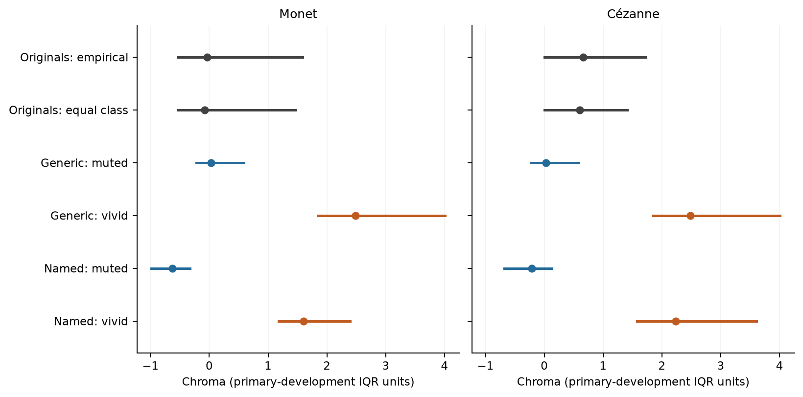
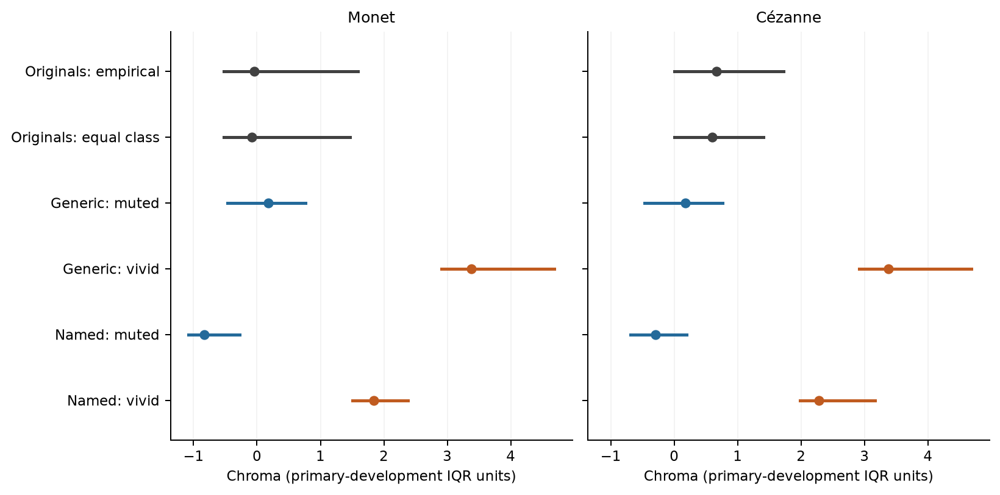

# Weighted empirical quantile correction

This corrigendum corrects floating-point CDF boundary assignment in descriptive reference and generated chroma quantiles. Quantiles use exact rational design weights and the first value with CDF at least 1/10, 1/2 or 9/10. Original artifacts remain unchanged. Primary inference, means, Wasserstein distances and image membership are preserved exactly. No images were opened or generated.

| Collection | Quantile records changed | Central-80 endpoint records | Coverage records changed |
| --- | ---: | ---: | ---: |
| prv2-oauth-recovery-20260908 | 51 | 0 | 0 |
| prv2-oauth-20260908 | 15 | 0 | 0 |

## prv2-oauth-recovery-20260908

[Affected quantiles](prv2-oauth-recovery-20260908/quantile_corrections.csv); [Affected coverage values](prv2-oauth-recovery-20260908/coverage_corrections.csv). Segments are empirical 10th–90th percentile ranges, not confidence intervals. Unavailable and selected ancillary distributions keep their original status.

## prv2-oauth-20260908

[Affected quantiles](prv2-oauth-20260908/quantile_corrections.csv); [Affected coverage values](prv2-oauth-20260908/coverage_corrections.csv). Segments are empirical 10th–90th percentile ranges, not confidence intervals. Unavailable and selected ancillary distributions keep their original status.

Counts concern records: shared generated summaries occur under more than one painter/reference-weighting comparison. All changed members and exact fractional weights are retained in corrections.json. Coverage is updated only when corrected range endpoints change accepted members; unaffected floating sums are preserved. The original/generated comparison remains computational and descriptive, without independent human, capture or oeuvre validation.
