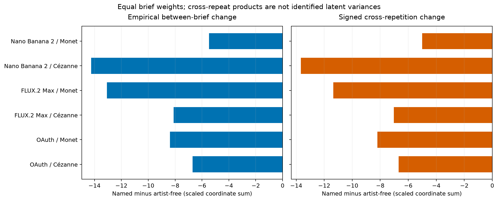
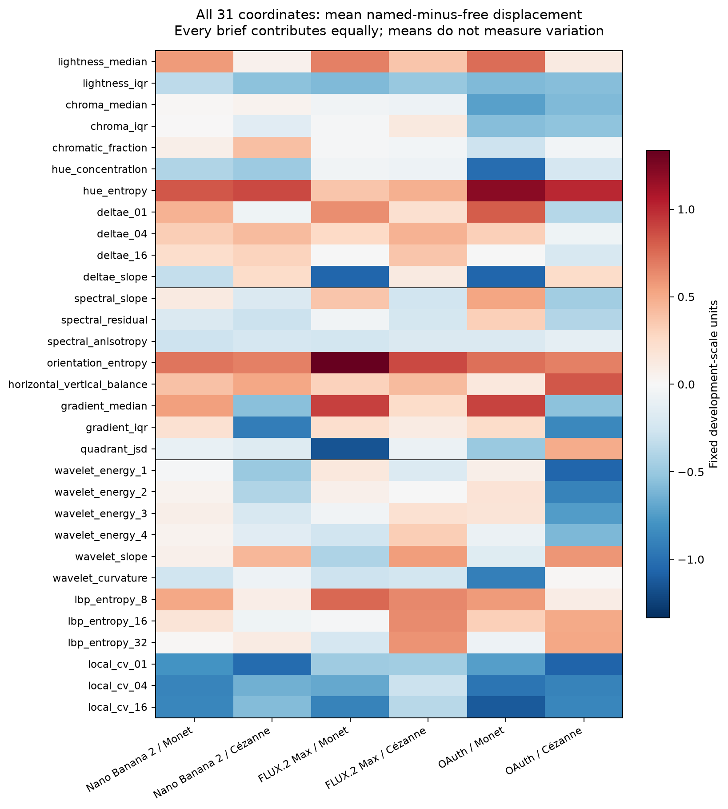
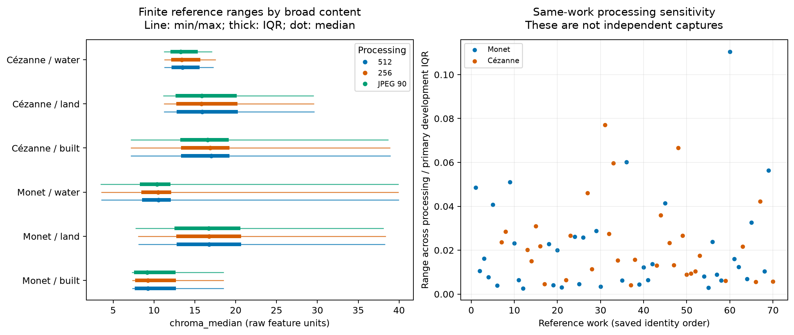

# Painter responsiveness: retained-data diagnostics and readiness

**Generation gate: `not_ready`.** Unmet prerequisites: `reference_range_validated`, `fine_content_independently_coded`, `reference_target_fixed`, `human_assessment_feasible`, `meaningful_margin_fixed`, `precision_accepted`, `provider_contract_available`, `budget_available`.

This is the D0 readiness snapshot before live metadata and actual human stages. Later provider and human receipts record their own status; they do not rewrite D0.

Independent fine-content reference support and human interpretation remain unvalidated in the retained-data diagnostic. Its numerical patterns cannot establish a perceptual or internal-model mechanism. No generation occurred in this analysis.

## What the saved vectors can and cannot show

The main summaries use primary512/original31 and equal brief/repetition weights. They therefore have a different target from the earlier painter-reference-content weighted comparison. Every named/free cell and every brief is retained.

| Cell | Empirical between-brief change | Cross-repeat change | Within-brief change |
| --- | ---: | ---: | ---: |
| Nano Banana 2 / Monet | -5.471450 | -5.011926 | -0.952831 |
| Nano Banana 2 / Cézanne | -14.242208 | -13.661333 | -1.265959 |
| FLUX.2 Max / Monet | -13.077255 | -11.347333 | -3.662004 |
| FLUX.2 Max / Cézanne | -8.112971 | -7.023613 | -2.197039 |
| OAuth / Monet | -8.379915 | -8.201151 | -0.394594 |
| OAuth / Cézanne | -6.701902 | -6.692680 | -0.039278 |

Negative changes describe contraction in these coordinates. A cross-repeat product can be negative and is not a variance constrained to be nonnegative. Interpreting it as stable between-brief signal requires stable brief means and independent zero-mean errors across repetition cohorts. Service state and timing do not establish those assumptions. All pair products and the separate content-only scopes are exported. There are no new p-values, population intervals or attenuation regressions.

This figure shows mean shifts, not variance changes or perceptual style axes. Individual brief vectors, including contrary movements, are in `brief_coordinates.csv`; exact generated memberships are in `brief_memberships.csv`. Shared shifts can reflect rendering consistency without loss of requested content. The current prompts do not randomize a visual attribute, so they cannot establish response attenuation.

## Reference chroma and feasibility

**Fine-content support: `unavailable`.** Reference subject labels are recorded free text, without a shared validated ontology or independent generated-content coding. Broad classes and exact string matches do not establish fine-content support or reference reachability.

Reference ranges are finite empirical summaries, not validated targets, tolerance intervals or independently confirmed reachability. Each work is compared across the three existing processing pipelines using one primary-development chroma scale. Alternate processing of the same file is not an alternate photographic capture. Singleton subject labels provide no within-stratum range evidence. All exact labels, IDs and values remain in the reference tables.

## Service metadata and proposed-design simulation

Successful measured outputs only; reported quality is not verified rendering quality. Treatment-associated metadata is not an adjustment variable.

`quality_groups.csv` retains all requested/reported groups and their exact request IDs. A prompt-associated quality report can reflect rendering, routing or reporting; it does not identify the setting actually used. Failed requests are not quietly redefined as measured images in this successful-output inventory.

Simulation: 192 planned images, 6 fixed templates, 2000 Monte Carlo trials per scenario/effect setting. All scenario results are in `simulation.csv`.

All outputs available; independent simulated errors. The six templates are fixed. Hypothetical effect grid is not a perceptually meaningful threshold. Residual-proxy simulation cannot establish future service power, independence, availability or reference validity. No image generation was performed.

Monte Carlo intervals describe simulation precision. They are not intervals for a future experiment. The generic arm uses an unvalidated historical artist-free noise proxy. An effect grid and a nominal image count do not supply a meaningful margin or demonstrate human/reference validation.

| Noise scenario | Monet power at −0.5 | Cézanne power at −0.5 | Monet median interval half-width | Cézanne median interval half-width |
| --- | ---: | ---: | ---: | ---: |
| empirical_proxy | 0.753 | 0.804 | 0.421 | 0.381 |
| generic_noise_x1_5 | 0.486 | 0.525 | 0.536 | 0.508 |
| heteroskedastic_normal | 0.219 | 0.230 | 0.818 | 0.809 |

The −0.5 interaction is hypothetical, in primary-development IQR units. Power means rejection of the corresponding zero interaction after Holm adjustment; interval widths refer to Bonferroni simultaneous intervals. Monte Carlo bounds, null/partial-null errors and all effect settings remain in `simulation.csv`.

## Reproduction and complete tables

This renderer reads the supplied numeric result only. It performs no image access, feature extraction, sampling, regression or statistical testing. List-valued CSV fields preserve their full values as JSON; blank fields mean unavailable. The publication receipt binds this report and its numeric input separately. All review is maintainer-run LLM review unless separately documented otherwise.

| Table | Rows |
| --- | ---: |
| [brief_coordinates.csv](brief_coordinates.csv) | 4464 |
| [brief_memberships.csv](brief_memberships.csv) | 864 |
| [brief_summaries.csv](brief_summaries.csv) | 144 |
| [cross_repeat_pairs.csv](cross_repeat_pairs.csv) | 144 |
| [gate_checks.csv](gate_checks.csv) | 8 |
| [quality_groups.csv](quality_groups.csv) | 16 |
| [reference_chroma_groups.csv](reference_chroma_groups.csv) | 225 |
| [reference_chroma_works.csv](reference_chroma_works.csv) | 70 |
| [reference_feasibility.csv](reference_feasibility.csv) | 1 |
| [scope_coordinates.csv](scope_coordinates.csv) | 744 |
| [scope_families.csv](scope_families.csv) | 72 |
| [scope_summaries.csv](scope_summaries.csv) | 24 |
| [simulation.csv](simulation.csv) | 18 |
| [subject_label_inventory.csv](subject_label_inventory.csv) | 2 |
