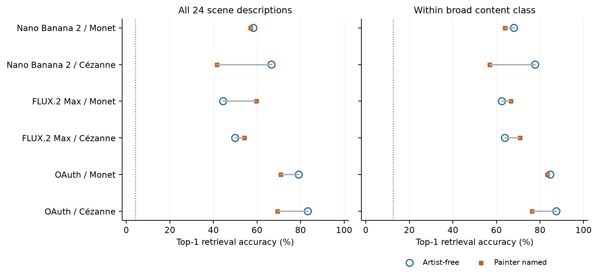
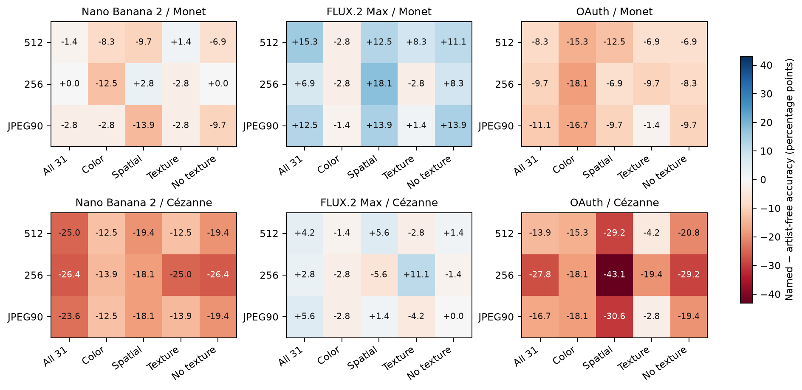

# Scene retrieval under painter naming

This post-result diagnostic tests whether contraction of saved feature vectors also means poorer identification of repeated scene descriptions. It uses the already exposed generated-image vectors, with no new images or human judgments.

In the six primary route/painter comparisons, top-1 accuracy increased in 2, decreased in 4, and was unchanged in 0 under naming. The table preserves both directions. Lower between-scene trace alone does not imply poorer repeat retrieval: uniform contraction preserves nearest-centroid geometry, and less within-scene noise can improve retrieval.

| Route / painter | Free accuracy | Named accuracy | Free midrank | Named midrank | Named/free between trace |
| --- | ---: | ---: | ---: | ---: | ---: |
| Nano Banana 2 / Monet | 58.3% | 56.9% | 2.847 | 3.181 | 0.7306 |
| Nano Banana 2 / Cézanne | 66.7% | 41.7% | 2.319 | 3.792 | 0.4015 |
| FLUX.2 Max / Monet | 44.4% | 59.7% | 2.722 | 2.361 | 0.3356 |
| FLUX.2 Max / Cézanne | 50.0% | 54.2% | 2.611 | 2.583 | 0.4607 |
| OAuth / Monet | 79.2% | 70.8% | 1.569 | 1.944 | 0.5151 |
| OAuth / Cézanne | 83.3% | 69.4% | 1.264 | 1.972 | 0.5437 |

Each query is held out by repetition; every candidate centroid uses only its other two repetitions. Training and querying use the same condition and the unchanged development feature scale. Dotted lines show 1/24 and 1/8 chance levels. Within-class retrieval removes broad prompt-class identification as an explanation for success; those classes are not independently verified visual annotations.

The sensitivity figure shows all-24-scene accuracy changes. The full 450-row table also includes within-class pooled and class-specific controls, midranks, all tie summaries and scope-matched traces. Positive accuracy changes favor named repeat retrieval. This is scene-associated feature geometry, not established prompt adherence, painter style, human perception or a causal mechanism.

Exact computed-distance ties use lexical brief IDs for deterministic top-1 output. Fractional tie credit, best/worst ranks and midranks retain the ambiguity. The immutable diagnostic JSON preserves every prediction and exact split via query and prediction-set IDs; those large tables are not duplicated here.

The simulation table is prospective sensitivity under retained noise proxies. Its effect grid is hypothetical; power and interval width are conditional on the stated noise and availability assumptions, not guarantees or perceptual margins.

## Complete numeric tables

| Table | Rows |
| --- | ---: |
| [noise_groups.csv](noise_groups.csv) | 96 |
| [noise_marginal_variances.csv](noise_marginal_variances.csv) | 4 |
| [retrieval_comparisons.csv](retrieval_comparisons.csv) | 450 |
| [simulation.csv](simulation.csv) | 18 |

Empty tables mean unavailable results. CSV list fields retain JSON arrays. Numbers are not recomputed by this renderer. The publication receipt binds input JSON and all report bytes; frozen numerical and report replay are separate from empirical validation. Reviews, unless explicitly identified otherwise, are maintainer-run LLM reviews, not independent human or institutional reviews.
