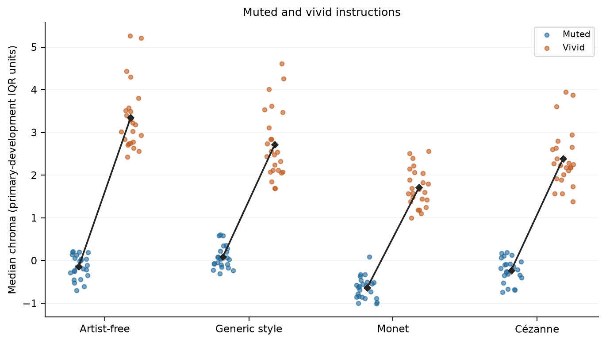
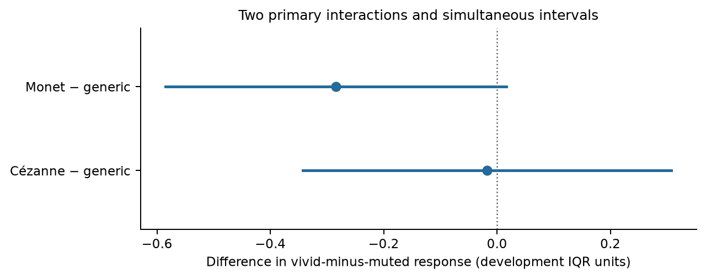
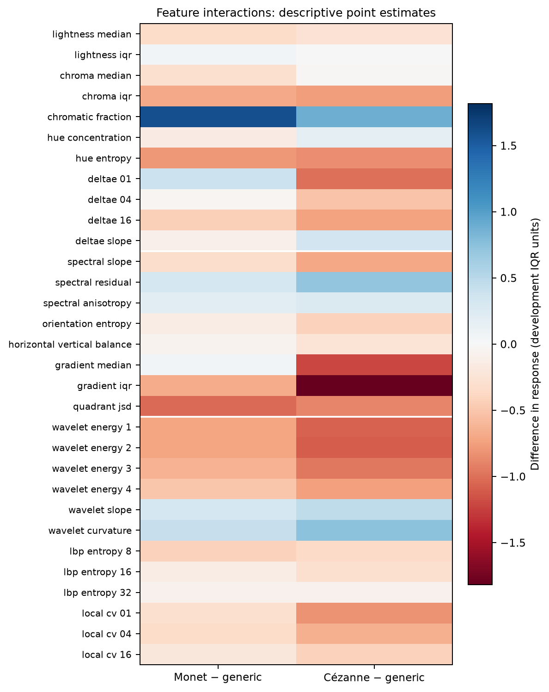
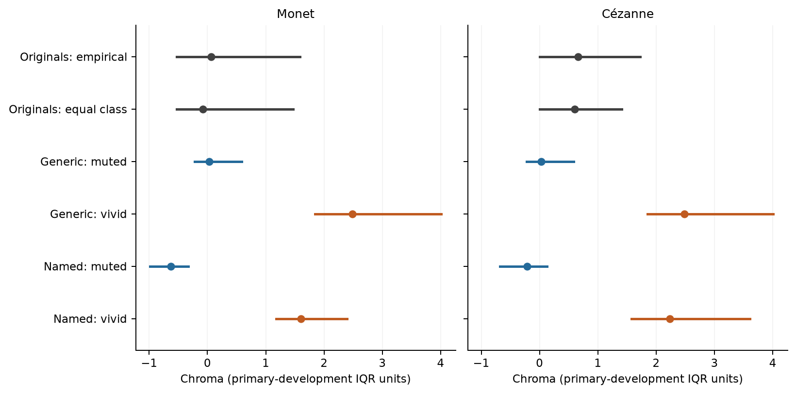

# Computational painter-name responsiveness

Primary inference status: `complete_grid_approximate_inference`. Collection status: `completed`; stop reason: `none recorded`. All 192 allocated images remain in the status tables. Measured counts by pipeline: `{"jpeg90_512": 192, "primary512": 192, "resolution256": 192}`.

The primary estimands are finite-template, two-instruction service response interactions in median image chroma. A negative named-minus-generic interaction supports attenuation only with positive free/generic responses and without a named response reversal. Two levels do not distinguish reduced gain from a shifted operating range or saturation. No human validation, internal model mechanism, perceptual fidelity, or explanation of the original/generated gap is established by these estimates.

Dots are available primary512 outputs; deterministic horizontal jitter only separates overlapping points. Diamonds and connecting lines are the supplied equal-template arm means. Missing outputs are not replaced by central or neutral values.

The two primary interactions are named-minus-generic differences in vivid-minus-muted chroma response. Simultaneous intervals use the prespecified Bonferroni allocation; Holm-adjusted p-values are reported separately. The shared generic draws are reflected in the retained two-by-two covariance matrix. These are approximate fixed-template, repeated-generation intervals, not exact weak-null randomization inference.

| Contrast | Estimate | Simultaneous interval | Holm p |
| --- | ---: | --- | ---: |
| monet_minus_generic | -0.28437 | [-0.58471, 0.01598] | 0.064857 |
| cezanne_minus_generic | -0.01772 | [-0.34306, 0.30761] | 0.88864 |

Control and named responses (nominal intervals; not separate confirmations):

| Arm | Vivid − muted | Nominal interval |
| --- | ---: | --- |
| Artist-free | 3.48858 | [3.36122, 3.61594] |
| Generic style | 2.63553 | [2.44327, 2.82779] |
| Monet | 2.35116 | [2.17922, 2.52311] |
| Cézanne | 2.61781 | [2.46248, 2.77314] |

Computational classifications preserve opposite and unresolved findings:

- Monet: interaction direction unresolved.
- Cézanne: interaction direction unresolved.

All 31 frozen primary512 coordinates, equal fixed-template weights; descriptive point estimates only, without additional hypothesis tests.
The chroma endpoint is the primary coordinate; the other point estimates do not add a family of significance tests. Processing sensitivity estimates and intervals are supplied separately in CSV, not treated as independent confirmations.

Points mark weighted medians; horizontal segments are empirical 10th–90th percentile ranges, **not confidence intervals**. Generated ranges use equal broad class mass. An incomplete stratum remains unavailable; any partially observed distribution is explicitly marked selected in the comparison table.

Post-result exposed digital references, not an independent holdout or human-validated style target. Broad classes were assigned by a single maintainer-run LLM; class weighting does not establish fine-content, period or capture matching. Empirical chroma overlap and Wasserstein distance concern one coordinate, not overall style or equivalence. The equal-polarity mixture is a designed experimental mixture, not a model's unprompted output distribution.
Exact work/request memberships and weights are preserved in the sealed JSON; compact CSVs retain every numerical comparison. The explicit instruction intervention tests a digital feature response. No human ratings have been supplied, and no learned model architecture is identified.

Attempt-level transport timing, delivery geometry and reported quality are exported when supplied. Missing metadata remains missing, not an assertion of matching quality.

Recorded inferential assumptions:

- Conditional on the six fixed templates and their equal weights; no new-scene inference.
- Independent replicate blocks with stable within-template distributions; block-common additive disturbances cancel in the response interactions.
- Welch–Satterthwaite t inference is approximate, including under non-Gaussian noise; randomized dispatch does not make a weak zero-interaction test exact.
- The two primary intervals use Bonferroni allocation of the family alpha. Holm-adjusted two-sided p-values are reported separately.
- Any unavailable planned measurement withholds primary inference. Complete-block survivor summaries cannot identify the originally allocated response effect.

## Complete numeric tables

| Table | Rows |
| --- | ---: |
| [arm_means.csv](arm_means.csv) | 8 |
| [availability.csv](availability.csv) | 8 |
| [cell_means.csv](cell_means.csv) | 48 |
| [collection_slots.csv](collection_slots.csv) | 192 |
| [complete_block_survivors.csv](complete_block_survivors.csv) | 0 |
| [computational_interpretation.csv](computational_interpretation.csv) | 2 |
| [coordinate_responses.csv](coordinate_responses.csv) | 31 |
| [generated_chroma.csv](generated_chroma.csv) | 576 |
| [generic_minus_free.csv](generic_minus_free.csv) | 1 |
| [primary.csv](primary.csv) | 2 |
| [primary_covariance.csv](primary_covariance.csv) | 2 |
| [processing_primary.csv](processing_primary.csv) | 4 |
| [reference_chroma.csv](reference_chroma.csv) | 210 |
| [reference_comparisons.csv](reference_comparisons.csv) | 144 |
| [reference_envelopes.csv](reference_envelopes.csv) | 12 |
| [responses.csv](responses.csv) | 4 |
| [secondary_named_minus_free.csv](secondary_named_minus_free.csv) | 2 |
| [transport_attempts.csv](transport_attempts.csv) | 192 |
| [transport_summary.csv](transport_summary.csv) | 1 |

Empty tables mean unavailable results. CSV list fields retain JSON arrays. Numbers are not recomputed by this renderer. The publication receipt binds input JSON and all report bytes; frozen numerical and report replay are separate from empirical validation. Reviews, unless explicitly identified otherwise, are maintainer-run LLM reviews, not independent human or institutional reviews.
